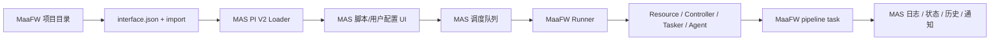

# AUTO-MAS 内建 MaaFramework 适配方案

## 目标

在 AUTO-MAS 中新增一类可直接适配 MaaFramework 项目的脚本入口。用户选择 M9A、MAAbbb 这类由其他 UI 框架打包出来的成品目录后，MAS 读取目录中的 `interface.json` 和其 `import` 文件，直接复用该目录内的 `resource/`、`agent/`、`python/` 等 MaaFW 项目资源，替代 MFAA、MFW-PyQt6、MWU 这类通用 UI 壳的运行位置，由 MAS 自身完成配置、任务队列、用户切换、调度、日志展示和 MaaFW 执行。

首批目标项目：

- M9A：`C:\Users\qiyin\Downloads\M9A-win-x86_64-v3.22.1`
- MAAbbb：`C:\Users\qiyin\Downloads\Maa_bbb-win-x86_64-v1.12.5`

最终效果：

1. 在 MAS 新增一个统一脚本类型，例如 `MaaFW` 或 `MaaFramework`。
2. 用户只需要选择 M9A、MAAbbb 等 MaaFW 成品目录，MAS 自动读取 `interface.json`。
3. 脚本页展示项目名称、版本、控制器、资源、预设和任务能力。
4. 用户配置页支持选择 controller/resource/preset，维护任务队列和任务选项。
5. MAS 调度队列可以添加该类脚本的统一入口。
6. 运行时由 MAS 后端直接创建 MaaFW `Resource`、`Controller`、`Tasker`，执行 `tasker.post_task(...)`。
7. 日志、状态、异常、停止信号进入 MAS 自身调度台和历史记录。

## 当前落地状态

截至本轮实现，`MaaFW` 已不只是规划入口，而是具备可手测的首版运行链路：

- 后端新增 `app/task/MaaFW/` 通用适配模块，支持读取 `interface.json` 与 `import`，构建 controller/resource/agent/task 运行计划。
- `MaaFWConfig` / `MaaFWUserConfig` 已注册到脚本配置、用户配置、API schema、脚本类型映射和 `TaskManager`，调度队列可以像其他脚本一样选择并派发 `MaaFW`。
- 运行时由 MAS 直接创建 MaaFW `Resource`、`Controller`、`Tasker`，并按用户任务快照调用 `tasker.post_task(...)`，不是 dry-run。
- ADB controller 支持用户/脚本直填地址、MAS 模拟器启动取地址、Toolkit 自动发现 adb、模拟器目录推导 adb。
- Win32/Gamepad controller 支持手填 HWnd；未填写时按 `interface.json` 的 `class_regex/window_regex` 自动扫描 PC 客户端窗口。M9A 和 MAAbbb 的 PC controller 均已验证存在对应 regex。
- 新增 `/api/scripts/maafw/interface/preview` 与 `/api/scripts/maafw/windows/preview`，前端可读取 interface 摘要并扫描 PC 客户端窗口。
- 前端新增 MaaFW 脚本编辑页和用户编辑页：可选项目目录、controller/resource/preset、维护任务快照、手填或扫描 HWnd，并接入 OpenAPI 生成客户端。
- runner 会捕获外部 agent 的 stdout/stderr，MaaFW resource/tasker/controller 事件也会回流到 MAS 调度日志和历史日志。
- runner 已加固 agent 启动链路：Windows 下优先使用 MaaFW TCP `AgentClient`，避免默认 IPC 构造在当前环境抛出 C++ 异常；外部 agent 子进程启动后会重试连接，失败时纳入统一 cleanup；Win32/Gamepad 缺少 HWnd 时会提前给出可操作错误；调度停止或超时时会主动清理 MaaFW tasker/agent。

已自测：

- `python -m pytest tests\test_maafw_interface_loader.py -q`：13 passed。
- M9A release 目录：interface/import/preset/run plan 读取通过。
- MAAbbb release 目录：interface/import/preset/run plan 读取通过，`./python/python.exe` 缺失时回退当前 AUTO-MAS Python 的计划逻辑通过。
- Win32 窗口 regex 匹配、显式 HWnd 优先、agent 输出读取、agent connect 重试、agent 早退错误、Win32/Gamepad HWnd 校验、取消 cleanup 均有单元测试覆盖。
- TestClient 自测 `POST /api/scripts/maafw/interface/preview`：M9A 返回 21 个任务/4 个预设/1 个 agent，MAAbbb 返回 36 个任务/3 个预设/1 个 agent。
- TestClient 自测脚本/用户/队列链路：`/api/scripts/add` 可创建 `MaaFWConfig`，`/api/scripts/user/add` 可创建 `MaaFWUserConfig`，`/api/queue/item/update` 可写入 MaaFW `scriptId`。
- TaskManager dry-run 自测：替换真实 `MaaFWManager` 为假执行器后，队列 `AutoProxy` 任务会正确分派到 MaaFW 分支，确认可进 MAS 调度队列。
- 真实 release 资源加载自测：M9A PC 资源 `resource/base`、`resource/global_jp`、`resource/global_en` 通过 `Resource.post_bundle()` 加载成功；MAAbbb PC 资源 `resource/base`、`resource/resource_win32` 加载成功。
- 真实 release agent 启动自测：M9A 使用随包 `python/python.exe -u ./agent/main.py`，TCP `AgentClient` 握手成功并输出 `AgentServer` 启动日志；MAAbbb 因无 `python/python.exe` 回退到当前 AUTO-MAS Python，agent 自检安装缺失依赖后 TCP 握手成功。
- 无真实客户端边界自测：使用假 `hWnd=1` 跑完整 `MaaFWRunner.run()` 时，M9A 与 MAAbbb 都先成功加载资源，再按预期失败在 MaaFW Win32 controller `connect`，失败点已推进到真实设备/游戏窗口连接层。
- 进程清理自测：M9A/MAAbbb agent 探针结束后未发现残留 `agent/main.py` 子进程。
- 包导入回归自测：修复 `app/__init__.py` 中 `app.task` 被 `app.models.task` 覆盖的问题后，`import app.task.MaaFW.runner as runner_module` 可正常工作。
- OpenAPI schema 自测包含 `/api/scripts/maafw/interface/preview`、`/api/scripts/maafw/windows/preview`、`MaaFWConfig`、`MaaFWUserConfig`、`MaaFWInterfacePreviewOut`、`MaaFWWindowPreviewOut`。
- `Get-ChildItem app\task\MaaFW -Filter *.py | ForEach-Object { python -m py_compile $_.FullName }` 已通过。
- `yarn exec openapi --input <temp-openapi.json> --output ./src/api --client axios` 已生成 MaaFW API 客户端。
- `yarn vite build` 已通过。
- `git diff --check` 已通过；仅有当前工作区已有 CRLF 提示。

仍需真实手测确认：

- 真实模拟器/ADB 连接、真实 PC 客户端连接、M9A/MAAbbb agent 在真实游戏环境中运行完整任务。
- MAAbbb `embedded: true` 在 external agent 模式下是否足够；若不够，需要追加 embedded 动态加载。
- MaaFW 业务级失败 callback 与项目内日志语义是否需要进一步映射到 MAS 的成功/失败判定。

核心边界：

- M9A/MAAbbb 的发布目录可以继续包含它们自己的 UI 可执行文件，MAS 不启动这些 UI。
- MAS 只把这些目录当成 MaaFW 项目包来消费。
- 资源、pipeline、图片、OCR 模型、agent 脚本和随包 Python 都从用户选择的目录原地读取。
- 用户配置、任务队列、调度计划、日志历史由 MAS 自己保存和展示。

## 已调研材料

### MaaFramework 文档

- `C:\Users\qiyin\Documents\GitHub\MaaFramework\docs\zh_cn\1.1-快速开始.md`
- `C:\Users\qiyin\Documents\GitHub\MaaFramework\docs\zh_cn\2.1-集成文档.md`
- `C:\Users\qiyin\Documents\GitHub\MaaFramework\docs\zh_cn\3.3-ProjectInterfaceV2协议.md`

关键结论：

- MaaFW 官方建议即使全代码集成，也定义 `interface.json`，因为 ProjectInterface 是通用 UI 和工具理解项目的标准声明。
- Python binding 是官方支持路径，适合 MAS 后端直接集成。
- PI V2 已覆盖 controller、resource、agent、task、option、global_option、preset、group、import、focus、资源 hash、Agent `PI_*` 环境变量。
- `import` 支持拆分导入 `task`、`option`、`preset`，M9A 和 MAAbbb 都依赖这个机制。

### AUTO-MAS 当前情况

已查看：

- `requirements.txt`
- `app/core/maa_manager.py`
- `app/task/M9A/`
- `app/api/scripts.py`
- `app/models/config.py`
- `app/models/schema.py`
- `app/core/task_manager.py`
- `frontend/src/views/EditView/User/M9AUserEdit.vue`
- `frontend/src/views/M9AUserEdit/TaskQueueSection.vue`

关键结论：

- 当前依赖里已有 `maafw==5.8.1` 和 `json5==0.14.0`。
- `app/core/maa_manager.py` 是固定资源工具封装，默认加载 `res/MaaFW`，适合工具能力，不适合作为 PI V2 通用执行器直接扩写。
- 当前 M9A 专项更接近 MFAA 线：写配置文件，再启动 `M9A.exe`，由外部程序读取配置运行。
- 当前 `M9ATaskLoader` 只扫描 `resource/tasks/*.json`，没有完整处理根 `interface.json` 的递归 `import`、`preset`、全局/资源/控制器级 option。
- 现有 M9A 用户页的任务队列、拖拽、选项编辑心智可以复用，但数据来源应改为通用 PI V2 loader。

### M9A 与 MAAbbb 应用目录

已查看：

- `C:\Users\qiyin\Downloads\M9A-win-x86_64-v3.22.1\interface.json`
- `C:\Users\qiyin\Downloads\Maa_bbb-win-x86_64-v1.12.5\interface.json`

关键结论：

- 两者根 `interface.json` 的 `task` 都是空数组，真实任务都通过 `import` 引入。
- M9A controller 包含 `ADB`、`PC`、`PlayCover`；首期 Windows/MAS 可先支持 `ADB` 和 `PC/Win32`。
- M9A agent 使用外部 Python：`./python/python.exe -u ./agent/main.py`。
- MAAbbb controller 包含 `桌面端` Win32 和 `安卓端` Adb。
- MAAbbb agent 带有 `embedded: true`，但 MVP 建议先使用外部 agent 模式，embedded 动态加载后置。
- MAAbbb 已有 `preset`，适合验证 PI V2 预设到 MAS 用户任务快照的转换。

### 参考前端/通用 UI 项目

已查看并归类：

- `C:\Users\qiyin\Documents\GitHub\MWU`
- `C:\Users\qiyin\Documents\GitHub\MFAAvalonia`
- `C:\Users\qiyin\Documents\GitHub\MFW-PyQt6`
- `C:\Users\qiyin\Documents\GitHub\Maa_bbb`

关键结论：

- MWU 是最有价值的架构参考，因为它也是 Vue + FastAPI，并直接使用 MaaFW。
- MWU 可参考点：
  - `models/interface.py`：PI V2 Pydantic 模型。
  - `models/interface_loader.py`：`import` 合并、冲突检测、路径校验、`scan_select`。
  - `models/task_config.py`：任务快照、预设、默认选项归一化。
  - `maa_worker/device_service.py`：controller/resource 连接和资源加载。
  - `maa_worker/task_service.py`：`tasker.post_task` 任务循环。
  - `maa_worker/pipeline_override.py`：global/resource/controller/task option 合并。
  - `maa_worker/agent_service.py`：Agent 环境变量与生命周期。
- MWU 不宜作为运行时依赖，也不应照搬前端技术栈。AUTO-MAS 仍使用自己的 FastAPI API 规范、WebSocket/调度台、Vue 3 + Ant Design Vue 页面语言。
- MFAAvalonia 和 MFW-PyQt6 适合作为 PI/任务语义和完整通用 UI 行为参考，但目标不是再启动或驱动它们。

## 设计取向

### 不做什么

- 不启动 MFAA/MFW-PyQt6/MWU 作为外部 GUI。
- 不让 MAS 通过鼠标、窗口、配置壳间接控制 MaaFW。
- 不把现有 `MaaFWManager` 扩成大而全全局单例。
- 不直接删掉当前 M9A 专项，先新增通用 MaaFW 适配并验证稳定后再迁移。

### 要做什么

MAS 自己成为 MaaFramework Client：



这个设计的本质是把 MaaFW ProjectInterface 当成 MAS 的脚本协议输入，而不是把某个通用 UI 当成 MAS 的子进程。

### 目录兼容模型

用户选择的是“其他 UI 框架的发布目录”，但 MAS 只关心其中的 MaaFW 项目结构：

```text
M9A 或 MAAbbb 发布目录
├── interface.json          # MAS 读取的入口
├── resource/ 或 tasks/     # 资源、pipeline、图片、OCR 模型等
├── agent/                  # 自定义 action/recognition/sink
├── python/                 # 项目随包 Python，external agent 可直接使用
├── config/                 # 原 UI 可能使用的配置，首期不依赖
└── *.exe                   # 原 UI 壳，MAS 不启动
```

适配时应遵守：

- 所有 PI 相对路径都以用户选择的目录为根目录解析。
- `resource.path` 按 PI 顺序加载，后加载资源覆盖先加载资源。
- `agent.child_exec` 和 `agent.child_args` 以项目根目录为 CWD 启动。
- MAS 不要求用户安装或打开原 UI。
- MAS 不应把自己的用户配置写入原 UI 的专有配置文件，除非某个项目任务确实通过 PI option 或 `scan_select` 显式引用这些文件。

## 建议新增脚本类型

建议技术标识使用：

- `ScriptType`: `MaaFW`
- 后端目录：`app/task/MaaFW/`
- 前端路由片段：`maafw`
- 用户可见名称：`MaaFramework 项目`

如果希望更正式，也可以使用 `MaaFramework` 作为技术标识，但 `MaaFW` 更短，和依赖包、社区叫法一致。

## 后端架构

### 模块边界

```text
app/task/MaaFW/
├── __init__.py
├── manager.py
├── runner.py
├── interface_loader.py
├── interface_models.py
├── task_config.py
├── pipeline_override.py
├── agent_service.py
├── controller_service.py
└── resource_service.py
```

建议职责：

- `manager.py`：对接 MAS `TaskExecuteBase` 生命周期，负责多用户迭代、状态聚合、异常处理。
- `runner.py`：单个用户的一次 MaaFW 执行流程。
- `interface_loader.py`：读取 `interface.json`，递归合并 `import`，校验路径和冲突。
- `interface_models.py`：PI V2 内部模型，尽量参考 MWU，但按 MAS 代码风格收敛。
- `task_config.py`：任务快照、预设转换、选项默认值归一化。
- `pipeline_override.py`：合并 task/global/resource/controller option 生成 MaaFW override。
- `agent_service.py`：启动/停止 external agent，注入 `PI_*` 环境变量。
- `controller_service.py`：创建 Adb/Win32 controller。
- `resource_service.py`：加载 resource.path 和 controller.attach_resource_path。

### 不复用 `app/core/maa_manager.py` 作为主入口的原因

现有 `MaaFWManager` 是工具型全局封装：

- 初始化时固定加载 `res/MaaFW`。
- 适合明日方舟 PC 工具、MaaEnd/SRC 登录工具等局部功能。
- 不是按每个 MaaFW 项目目录、每个用户、每个资源组合创建隔离运行环境。

新的 MaaFW 适配需要每个项目/用户独立加载资源和 controller，因此应在 `app/task/MaaFW/` 新建执行器。

### 配置模型

脚本级配置建议：

```text
MaaFWConfig
├── Info
│   ├── Name
│   └── Path
├── Run
│   ├── TaskTimeout
│   ├── StartAgentMode
│   ├── EnableDebugLog
│   └── IfStopOnTaskFailed
└── UserData
```

用户级配置建议：

```text
MaaFWUserConfig
├── Info
│   ├── Name
│   ├── Controller
│   ├── Resource
│   ├── AdbDeviceUid
│   └── Win32WindowHint
├── Task
│   ├── SelectedPreset
│   ├── TaskOrder
│   ├── TaskChecked
│   └── TaskOptions
├── Notify
└── Data
    ├── LastInterfaceVersion
    ├── LastProjectVersion
    └── LastRunAt
```

说明：

- `TaskOrder` 使用 task entry 作为执行 ID，因为 MaaFW 运行入口是 `task.entry`。
- UI 展示可使用 `task.label || task.name`。
- `preset` 中按 task name 引用任务，需要 loader 建立 `name -> entry` 映射。
- 用户配置不直接保存完整 interface，避免项目升级后配置膨胀；只保存用户选择和快照。

## API 设计

遵循 MAS 现有 `OutBase` 风格，新增或扩展 `app/api/scripts.py`。

建议接口：

| 接口 | 用途 |
| --- | --- |
| `POST /api/scripts/maafw/interface` | 读取脚本目录的 interface 元数据 |
| `POST /api/scripts/maafw/validate-path` | 校验目录是否为可用 MaaFW 项目 |
| `POST /api/scripts/maafw/tasks` | 获取任务、分组、预设、选项 |
| `POST /api/scripts/maafw/scan-select/rescan` | 重扫某个 `scan_select` option |
| `POST /api/scripts/maafw/controller/devices` | 按 controller 类型列可连接目标 |

注意：

- 后端 schema 改动后需要运行 OpenAPI 生成流程。
- 不手改 `frontend/src/api/**` 生成文件。
- 可先在 P0/P1 用少量接口支撑页面，避免一次把所有 PI V2 能力都铺满。

## 前端架构

### 脚本编辑页

文件建议：

- `frontend/src/views/EditView/Script/MaaFWScriptEdit.vue`

能力：

- 选择 MaaFW 项目目录。
- 展示项目名、版本、GitHub、描述、controller/resource/task/preset 数量。
- 提示 interface 解析失败原因。
- 运行配置：任务超时、调试日志、失败是否停止、agent 启动模式。

### 用户编辑页

文件建议：

- `frontend/src/views/EditView/User/MaaFWUserEdit.vue`
- `frontend/src/views/MaaFWUserEdit/BasicInfoSection.vue`
- `frontend/src/views/MaaFWUserEdit/TaskQueueSection.vue`
- `frontend/src/views/MaaFWUserEdit/TaskOptionRenderer.vue`
- `frontend/src/views/MaaFWUserEdit/NotifyConfigSection.vue`

能力：

- 选择 controller。
- 按 controller 过滤 resource。
- ADB controller 可绑定 MAS 已有模拟器/设备管理能力。
- Win32 controller 可展示 window_regex/class_regex，后续支持窗口扫描。
- 选择 preset，并生成可编辑的任务快照。
- 任务队列支持勾选、排序、分组、搜索。
- 按 PI option 类型渲染：
  - `select`
  - `switch`
  - `checkbox`
  - `input`
  - `scan_select`
- 任务选项按 controller/resource 适用性隐藏或禁用。

UI 方向：

- 复用现有 M9A 任务队列心智。
- 组件使用 Ant Design Vue，不照搬 MWU 的 NaiveUI/Pinia 结构。
- 页面保持 MAS 桌面业务工具风格，避免做成独立 MaaFW 面板应用。

## 运行流程

单个用户运行流程：

1. `MaaFWManager.check()` 校验脚本路径、interface、controller/resource、任务队列。
2. `MaaFWManager.main_task()` 按 MAS 用户列表逐个执行。
3. 对当前用户创建 `MaaFWRunner`。
4. loader 读取并缓存 interface。
5. 创建 MaaFW `Resource`。
6. 加载当前 `resource.path`。
7. 加载当前 controller 的 `attach_resource_path`。
8. 创建 controller：
   - Adb：使用 MAS 设备/模拟器信息生成 `AdbController`。
   - Win32：按 PI 的 `class_regex/window_regex/screencap/mouse/keyboard` 创建 `Win32Controller`。
9. 创建 `Tasker` 并 bind resource/controller。
10. 启动 external Agent，注入 `PI_*` 环境变量。
11. 从用户任务快照中取出已勾选任务，按顺序执行。
12. 每个任务执行前构建 `pipeline_override`。
13. 调用 `tasker.post_task(entry, pipeline_override)`。
14. 监听 MaaFW callback/focus/log，写入 MAS websocket 和调度日志。
15. 停止时调用 `tasker.post_stop()`，清理 agent。
16. 写用户状态、历史、通知。

多用户切换：

- MAS 外层仍按用户列表迭代。
- 每个用户拥有独立 controller/resource/task/options 配置。
- 同一项目不同用户可以选择不同资源、不同任务队列、不同 ADB 设备或 Win32 窗口。
- 用户之间不共享 MaaFW `Tasker` 实例，降低串配置风险。

## Agent 策略

### MVP

先只实现 external agent：

- 使用 `agent.child_exec` + `agent.child_args` 启动子进程。
- CWD 设为 MaaFW 项目根目录。
- 注入 PI V2 约定的环境变量：
  - `PI_INTERFACE_VERSION`
  - `PI_CLIENT_NAME`
  - `PI_CLIENT_VERSION`
  - `PI_CLIENT_LANGUAGE`
  - `PI_CLIENT_MAAFW_VERSION`
  - `PI_VERSION`
  - `PI_CONTROLLER`
  - `PI_RESOURCE`

原因：

- M9A 明确带独立 Python。
- MAAbbb 虽然声明 `embedded: true`，但 external agent 更稳定，也更符合 MAS 首期可控范围。
- embedded 动态加载涉及 import hook、依赖隔离、打包兼容，适合后置。

### 后续

- 支持 `embedded: true` 的动态 agent 模式。
- 支持多个 agent。
- 支持 agent 崩溃重启策略。

## PI V2 能力分期

### MVP 必须支持

- `interface_version`
- `name/title/version/github/description/icon`
- `controller`: `Adb`、`Win32`
- `resource.path`
- `resource.controller`
- `agent.child_exec`
- `agent.child_args`
- `task.name`
- `task.label`
- `task.entry`
- `task.group`
- `task.option`
- `option`: `select`、`switch`、`checkbox`、`input`
- `preset`
- `import`

### P2 支持

- `global_option`
- `resource.option`
- `controller.option`
- `option.controller`
- `option.resource`
- `scan_select`
- `focus` 日志模板

### P3 支持

- `resource.hash`
- `controller.attach_resource_path`
- `permission_required` 管理员提示
- `languages` 国际化文件
- 多 agent
- `PlayCover`、`Gamepad`、`MacOS` 等非首期 controller

## M9A 覆盖策略

M9A 首期适配重点：

- 读取根 `interface.json`。
- 递归导入 `resource/tasks/...`。
- 支持 `ADB` 和 `PC` controller。
- 支持 `官服/B服/国际服` 等 resource。
- 任务页过滤 `standalone` 分组作为默认可选项，但保留高级开关允许显示。
- 使用任务 entry 执行 pipeline。
- 使用 external agent。

与当前 M9A 专项的关系：

- 当前 M9A 专项继续保留，作为稳定路径。
- 新 `MaaFW` 类型用于直接控制 MaaFW。
- 验证通过后再决定：
  1. 保留 `M9A` 作为历史兼容。
  2. 在新增脚本时推荐使用 `MaaFW`。
  3. 提供 M9A 配置迁移工具。
  4. 最终移除或弱化旧 M9A 专项入口。

## MAAbbb 覆盖策略

MAAbbb 首期适配重点：

- 读取根 `interface.json`。
- 递归导入 `tasks/...`。
- 支持 `桌面端` Win32 和 `安卓端` Adb。
- 支持 `键鼠操作/纯键盘操作/官服/B服/...` resource。
- 识别并应用 `preset`：
  - `日常-简化版`
  - `日常-完整版`
  - `建议单独运行`
- 先按 external agent 跑通，即使 interface 声明 `embedded: true`。
- 任务页按 `group` 分组展示日常、周常、周期性、商店、活动、单独运行工具。

## 调度与队列集成

MAS 层面不新增一套 MWU scheduler，而是接入现有调度。

需要覆盖：

- `app/core/task_manager.py` 注册 `MaaFWManager`。
- `TYPE_BOOK` 增加展示文案，避免调度 combobox KeyError。
- 脚本队列中可以添加 `MaaFW` 脚本。
- 调度台展示每个用户的 MaaFW 运行日志。
- 停止队列时能传递到当前 `Tasker.post_stop()`。
- 执行历史保留任务结果、异常原因、耗时。

状态建议：

```text
等待 -> 连接设备 -> 加载资源 -> 启动 Agent -> 运行任务 -> 完成
                                      └-> 异常
                                      └-> 已停止
```

## 日志与通知

日志来源：

- MAS `logger`
- MaaFW callback
- Agent stdout/stderr
- focus 模板解析后的业务日志

展示位置：

- 调度台实时日志。
- 用户执行历史。
- 通知 Section 复用 MAS 现有通知能力。

首期做法：

- callback 原始事件先映射为普通日志。
- Agent stdout/stderr 作为 debug 日志采集。
- focus 模板可以先只支持 `display=log`。

后续：

- `toast` 映射 MAS 前端 message。
- `notification` 映射系统通知。
- `dialog/modal` 需要设计阻塞/非阻塞交互，不建议首期做。

## 实施阶段

### 当前进度

已完成第一轮 P0/P0.5 和后端 P1 MVP 落地：

- 新增 `app/task/MaaFW/` 的 PI V2 基础模型、`interface.json`/`import` loader 和任务快照转换。
- 新增 `POST /api/scripts/maafw/interface/preview` 只读接口，用于传入 MaaFW 发布目录并返回 MAS UI 可消费的项目摘要。
- 新增 `pipeline_override.py`，按 PI V2 语义合并 `global_option/resource.option/controller.option/task.option` 和 case/input/scan_select override。
- 新增 `run_plan.py`，作为真实 Runner 的前置解析层，输出 controller、resource bundle、agent 命令、PI 环境变量、可执行任务和每个任务的 pipeline override。
- 新增 `runner.py` 骨架，能基于运行计划创建独立 `Resource/Tasker`、连接显式传入的 ADB/Win32/Gamepad/PlayCover 设备、启动 external agent，并逐个执行 `tasker.post_task(entry, override)`。
- 新增 `MaaFWConfig` / `MaaFWUserConfig`，保存项目路径、模拟器/ADB、Win32/PlayCover、controller/resource、任务快照和运行限制。
- 已将 `MaaFW` 注册进 `GlobalConfig.ScriptConfig`、`CLASS_BOOK`、API `SCRIPT_BOOK/USER_BOOK`、`ScriptCreateIn`、脚本/用户响应 union、`TYPE_BOOK` 和 `task_manager`。
- 新增 `MaaFWManager` / `AutoProxyTask`，接入 MAS 多用户生命周期；运行时会从用户任务快照或 interface preset 构造 run plan，再交给真实 `MaaFWRunner` 执行。
- ADB controller 支持复用 MAS 模拟器配置，也支持直接填写 ADB 地址；ADB 路径优先使用脚本配置，其次从 MaaFW Toolkit 或模拟器配置推导。
- Win32/Gamepad/PlayCover 设备字段已进入配置；Win32 默认使用 `interface.json` 声明的截图/输入方法，避免覆盖 MAAbbb/M9A PC 端项目声明。
- 新增本地验证测试 `tests/test_maafw_interface_loader.py`，覆盖 M9A 与 MAAbbb 目录。
- 新增 `requirements-dev.txt`，补充 `pytest` 测试依赖。
- 已验证：
  - M9A：3 个 controller、9 个 resource、21 个 task、69 个 option、4 个 preset。
  - MAAbbb：2 个 controller、10 个 resource、36 个 task、131 个 option、3 个 preset。
  - MAAbbb 存在两个任务共用同一个 `entry` 的情况，因此通用 MaaFW 配置快照改用 `task.name` 作为 UI/配置层任务 ID，执行前再映射到 `task.entry`。
  - MAAbbb 发行目录的 `interface.json` 声明 `./python/python.exe`，但实际目录没有该文件；运行计划会在 `agent/main.py` 存在时回退到当前 AUTO-MAS Python，并记录 fallback 原因。
  - `python -m pytest tests/test_maafw_interface_loader.py -q` 已通过，当前为 `13 passed`。
  - `POST /api/scripts/maafw/interface/preview` TestClient 自测通过：
    - M9A：`200 M9A 3 controller / 9 resource / 21 task / 4 preset`
    - MAAbbb：`200 MAA_bbb 2 controller / 10 resource / 36 task / 3 preset`

说明：曾计划做用户可见 dry-run/self-test 入口；根据目标调整，dry-run 不作为最终保留的产品模式。现在保留的是 Runner 必需的内部运行计划构建能力，用于真实执行前解析和测试验证。

### P0: 调研验证与 loader 原型

目标：

- 新增 PI V2 loader 原型。
- 能读取 M9A 和 MAAbbb 的 `interface.json`。
- 能递归合并 `import`。
- 能输出任务、资源、控制器、预设、选项摘要。

验收：

- M9A 任务不再是空数组。
- MAAbbb 预设能转换成 MAS 任务快照。
- JSONC/JSON5 注释文件能解析。
- 路径越界、重复 task/option/preset 有明确错误。

### P1: MaaFW Runner MVP

当前状态：后端 MVP 已接入 MAS 配置、脚本类型注册、任务调度分派、用户配置和真实 runner。由于前端页面尚未接入，当前更适合通过 API/配置文件或后端测试手动验证；真实跑任务需要用户已配置 MAS 模拟器或显式 ADB/Win32/PlayCover 参数。

目标：

- 后端直接创建 MaaFW resource/controller/tasker。
- 支持 Adb 和 Win32。
- 支持 external agent。
- 支持执行用户勾选任务队列。
- 支持停止和清理。

验收：

- M9A 至少跑通一个简单任务队列。
- MAAbbb 至少跑通一个预设中的基础任务。
- 任务日志进入 MAS 调度台。
- 停止任务不会留下孤儿 agent 进程。

下一步要补：

- 任务 option 细粒度编辑器：当前前端 MVP 会保存 preset 中的 `taskOptions`，手动编辑先支持任务勾选与顺序；后续补 select/input/scan_select 的完整渲染。
- Win32 窗口选择：当前支持显式 hWnd；后续需要 UI 或窗口枚举服务让用户选择目标窗口。
- MaaFW callback/focus 事件和 agent stdout/stderr 的更完整日志映射；当前 runner 文本日志已经进入 MAS 调度台，但还不是 PI V2 富事件展示。

### P2: MAS 前端集成（MVP 已完成）

目标：

- 新增 `MaaFW` 脚本编辑页。
- 新增 `MaaFW` 用户编辑页。
- 支持 controller/resource/preset/task/options 配置。
- 接入脚本列表、路由、`useScriptApi`、图标与文案。

验收：

- 可以从 MAS UI 新增 MaaFW 脚本。
- 可以为同一脚本新增多个用户配置。
- 可以切换用户、切换配置、保存任务队列。
- 不依赖 MFAA/MFW-PyQt6/MWU。

当前已完成：

- 新增 `frontend/src/views/EditView/Script/MaaFWScriptEdit.vue`：支持选择 MaaFW 项目目录、读取 `interface.json` 预览、保存模拟器/ADB/Win32/PlayCover/运行限制。
- 新增 `frontend/src/views/EditView/User/MaaFWUserEdit.vue`：支持新增/编辑用户、controller/resource/preset 选择、任务勾选、任务顺序、设备覆盖、额外脚本与基础通知配置。
- 新增 `frontend/src/composables/useMaaFWApi.ts`：已切换为 OpenAPI 生成的 `MaaFwService` 访问 `POST /api/scripts/maafw/interface/preview`，并在 composable 内把可选数组归一化为 UI 可直接消费的数据。
- 已执行 `yarn openapi` 正式刷新 `frontend/src/api`，生成 `MaaFwService`、`MaaFWConfig`、`MaaFWUserConfig` 与 interface preview 相关模型。
- 已接入 `ScriptType`、`useScriptApi`、`Scripts.vue`、`ScriptTable.vue`、`router/index.ts`。
- `yarn vite build` 已通过，新增 `MaaFWScriptEdit` 和 `MaaFWUserEdit` chunk。

### P3: 调度队列完整接入

目标：

- `MaaFW` 可作为 MAS 脚本队列项目。
- 支持 MAS 调度时间、调度队列、执行历史。
- 多用户执行状态正确聚合。

验收：

- 调度队列能运行 MaaFW 项目。
- 单用户失败不阻断其他用户，除非配置为失败停止。
- 历史记录和通知可用。

### P4: PI V2 完整度增强

目标：

- `global_option/resource.option/controller.option/task.option` 完整合并。
- `scan_select` 重扫。
- `focus` 展示渠道映射。
- `resource.hash` 警告。
- `permission_required` 管理员提示。

验收：

- 复杂 option 能正确生成 `pipeline_override`。
- MAAbbb 和 M9A 的实际常用任务不需要手工特殊分支。

### P5: 迁移与收敛

目标：

- 评估旧 `M9A` 专项是否迁移到 `MaaFW`。
- 提供旧配置导入/转换。
- 清理重复 UI 和后端分支。

验收：

- 用户可以从旧 M9A 专项平滑迁移。
- 新用户优先使用 `MaaFW` 通用入口。
- 旧入口保留或移除有明确兼容策略。

## 风险与待确认

### MaaFW 版本

当前 `requirements.txt` 是 `maafw==5.8.1`。MWU 使用的能力更接近新 PI V2，可能需要评估升级到 `maafw>=5.10.2` 的风险。

待确认：

- 升级 MaaFW 是否影响现有 `app/core/maa_manager.py` 和 MaaEnd/SRC 工具。
- 若不升级，当前 binding 是否支持所需 controller/resource/tasker/agent 能力。

### Agent 模式

MAAbbb 声明 `embedded: true`，但首期 external agent 更稳。当前 runner 对所有 agent 先走 `AgentClient + 子进程`，不实现 MWU 的 embedded 黑魔法加载。

待确认：

- MAAbbb 在 external agent 下是否完整可运行。
- 如果必须 embedded，是否接受 P1 后追加动态加载实现。

### MAAbbb 打包形态

MAAbbb 的 release 目录更像 MFW/PyInstaller 运行目录：根目录有 `MFW.exe`、`python312.dll`、大量 Python 包和 `agent/main.py`，但没有 PI 声明的 `python/python.exe`。

当前处理：

- 运行计划中检测到 `./python/python.exe` 不存在且 `agent/main.py` 存在时，回退到当前 AUTO-MAS Python。
- 真实运行时会把项目根目录放入 `PYTHONPATH`，让 agent 能引用 release 目录内的依赖。

待确认：

- MAAbbb agent 在系统 Python + release 根目录 `PYTHONPATH` 下是否能完整加载 PySide/maafw/自定义模块。
- 如果不能，需要改为寻找 release 内部可执行入口或实现 embedded 导入方案。

### Win32 权限

M9A PC 和 MAAbbb 桌面端都存在 `permission_required: true`。

待确认：

- MAS 当前进程是否以管理员运行。
- 是否需要提供“以管理员重启 MAS”的操作入口。

### 任务失败判定

MaaFW `post_task` 的完成状态和业务成功不一定完全等价。

待确认：

- 哪些 MaaFW callback/message 代表失败。
- 是否需要按项目补充业务日志判定。

### 配置兼容

旧 M9A 专项保存的是 MFAA/M9A 队列语义，新 `MaaFW` 保存 PI V2 任务快照。

待确认：

- 是否需要旧配置一键迁移。
- 迁移时任务名称和 entry 如何映射。

## 推荐决策

建议先确认两个产品决策：

1. 新类型技术名使用 `MaaFW` 还是 `MaaFramework`。
2. MVP 是否按“external agent + Adb/Win32 + M9A/MAAbbb 双项目验证”收敛。

推荐选择：

- 技术名：`MaaFW`
- 用户可见名：`MaaFramework 项目`
- MVP 范围：external agent、Adb、Win32、interface import、preset、任务队列、基础 option、MAS 调度日志

这个范围可以最快验证核心价值：MAS 不再依赖 MFAA/MFW-PyQt6/MWU，直接消费 MaaFW 项目协议，并能同时覆盖 M9A 与 MAAbbb。
