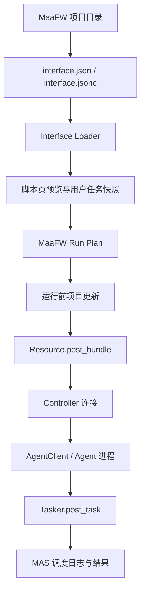

# MaaFW 模块原理与应用文档

本文档说明 AUTO-MAS 内置 MaaFW 适配模块的定位、运行原理、用户使用方式和维护入口。测试步骤见 [MAAFW_TESTING.md](MAAFW_TESTING.md)。

## 模块定位

MaaFW 模块让 MAS 直接消费一个标准 MaaFramework 项目目录，而不是再启动 M9A、MAAbbb、MFW-PyQt6、MWU 这类外部 UI。

用户选择的目录需要包含 `interface.json` 或 `interface.jsonc`。MAS 会读取 ProjectInterface、导入 task/option/preset/resource/controller/agent 信息，再把这些信息转成 MAS 自己的脚本配置、用户配置、调度任务和运行日志。

当前主要验证对象：

- M9A release 目录。
- MAAbbb release 目录。
- 其他符合 MaaFramework ProjectInterface V2 的项目目录。

## 用户应用流程

1. 在脚本页新增 `MaaFW` 脚本。
2. 设置项目目录，目录内应包含 `interface.json`。
3. 点击读取或预览 interface，确认项目名、版本、controller、resource、preset、task 正常显示。
4. 在脚本配置里设置默认设备信息：
   - ADB 项目优先设置模拟器、ADB 路径或 ADB 地址。
   - PC 项目可扫描窗口或手动填写 HWnd。
5. 新增用户，在用户页选择 controller/resource/preset，调整任务勾选和任务选项。
6. 把该用户加入队列并运行。
7. 运行前如开启自动更新，MAS 会先尝试更新项目目录，再重新读取 interface 并运行。

## 核心数据流

## 代码结构

| 文件 | 职责 |
| --- | --- |
| `app/task/MaaFW/interface_models.py` | ProjectInterface V2 的 Pydantic 模型。 |
| `app/task/MaaFW/interface_loader.py` | 读取 `interface.json/jsonc`、处理 `import`、校验路径和引用关系。 |
| `app/task/MaaFW/task_config.py` | 将 PI preset/task/option 转成 MAS 用户任务快照。 |
| `app/task/MaaFW/pipeline_override.py` | 根据全局、resource、controller、task 级 option 构造 MaaFW pipeline override。 |
| `app/task/MaaFW/run_plan.py` | 把用户选择转换为一次可执行的 MaaFW 运行计划。 |
| `app/task/MaaFW/runner.py` | 创建 MaaFW Resource、Controller、Tasker、AgentClient 并执行任务。 |
| `app/task/MaaFW/project_updater.py` | 运行前检查和应用 MaaFW 项目更新。 |
| `app/task/MaaFW/window_service.py` | Windows 下扫描和匹配 PC 窗口。 |
| `app/task/MaaFW/AutoProxy.py` | 单用户执行入口，负责设备配置、运行计划和结果写回。 |
| `app/task/MaaFW/manager.py` | MAS 调度入口，负责脚本锁定、用户遍历、运行前更新和生命周期。 |
| `frontend/src/views/EditView/Script/MaaFWScriptEdit.vue` | MaaFW 脚本配置页。 |
| `frontend/src/views/EditView/User/MaaFWUserEdit.vue` | MaaFW 用户任务配置页。 |
| `frontend/src/composables/useMaaFWApi.ts` | 前端 MaaFW API 调用封装。 |

## 配置模型

`MaaFWConfig` 是脚本级配置，主要保存：

- `Info.Path`：MaaFW 项目目录。
- `Emulator`：ADB controller 可复用 MAS 模拟器配置。
- `Device`：ADB、Win32、Gamepad、PlayCover 的默认连接参数。
- `Update.IfAutoUpdate`：是否运行前自动更新项目目录。
- `Update.MirrorChyanCDK`：脚本专用 Mirror 酱 CDK。
- `Run`：运行次数、代理次数和运行时间限制。

`MaaFWUserConfig` 是用户级配置，主要保存：

- `Info.Controller`：当前用户选择的 controller。
- `Info.Resource`：当前用户选择的 resource。
- `Task.SelectedPreset`：当前使用的 preset。
- `Task.TaskSnapshot`：任务顺序、勾选状态和任务选项。
- `Device`：用户级设备覆盖项。
- `Data` / `Notify`：运行数据和通知配置。

新建 MaaFW 脚本时，MAS 会把全局更新配置里的 Mirror 酱 CDK 写入脚本配置；运行时脚本 CDK 为空则回退全局 CDK。

## API 表面

新增 MaaFW 相关接口集中在 `app/api/scripts.py`：

- `/api/scripts/maafw/interface/preview`：读取项目目录并返回 interface 摘要。
- `/api/scripts/maafw/windows/preview`：按 interface controller 的窗口匹配规则扫描 PC 窗口。

这些接口只做请求解析和响应整形，具体读取、校验、窗口扫描逻辑仍放在 `app/task/MaaFW/` 模块内。

## Interface 读取原则

Loader 的目标是把 ProjectInterface 变成 MAS 可消费的稳定结构：

- 支持 `interface.json` 和 `interface.jsonc`。
- 支持 `import` 引入 task、option、preset 等拆分文件。
- 禁止绝对路径、`..` 越界路径和导入循环。
- 校验 task/resource/controller/option/preset 的引用关系。
- 支持 `scan_select` 这类需要扫描文件生成选项的场景。

Loader 不做 MaaFW 运行，也不做网络更新。它只负责把磁盘上的 PI 数据读准、合并准、报错准。

## 运行计划

Run Plan 是 MAS 和 MaaFW 运行时之间的边界对象。它包含：

- 选中的 controller/resource。
- 要加载的 resource path 和 attached path。
- agent 启动命令、工作目录、环境变量。
- 要执行的 task 列表。
- 每个 task 的 pipeline override。
- PI v2.5 约定的 `PI_*` 环境变量。

这一层的作用是把“用户配置”和“interface 原始结构”折叠成一次运行所需的确定输入。后续 runner 只按计划执行，不再重新猜测用户意图。

## Runner 执行顺序

一次 MaaFW 任务运行按以下顺序执行：

1. 安装 MaaFW resource 日志 sink。
2. 对 resource 路径逐个调用 `Resource.post_bundle()`。
3. 创建并连接 controller。
4. 绑定 Resource、Controller、Tasker。
5. 启动 agent 并等待 AgentClient 连接。
6. 逐个执行 `Tasker.post_task()`。
7. 清理 agent、controller、tasker、resource。

这个顺序决定了一个重要限制：如果某个项目的 agent 启动后才修改 `resource/`，本次运行已经加载进 MaaFW 的资源对象不会自动刷新，通常要下一次运行才生效。

## Controller 支持

当前 runner 支持以下 controller 类型：

- `Adb`：需要 ADB 路径和设备地址，可从 MAS 模拟器配置推导。
- `Win32`：需要窗口句柄 HWnd，可由窗口扫描接口辅助选择。
- `Gamepad`：需要 HWnd 和 gamepad 类型。
- `PlayCover`：需要地址和 UUID。

Win32 / Gamepad 若没有 HWnd，会在运行前直接给出可操作错误，不会等到 MaaFW 内部连接失败才暴露。

## Agent 原理

MaaFW 的自定义识别和自定义动作通常通过 AgentServer 提供，MAS 在 runner 中创建 AgentClient 并启动项目声明的 agent。

当前实现要点：

- Windows 下优先使用 TCP AgentClient，避免默认 IPC 在当前环境里出现 C++ 层异常。
- agent 子进程会继承 `PI_*` 环境变量，便于读取当前 client、controller、resource、项目版本等上下文。
- stdout/stderr 会桥接回 MAS 调度日志。
- agent 启动失败、提前退出或连接超时都会进入统一清理。

当前限制：

- `agent.embedded: true` 目前仍按外部进程启动处理。
- MWU/MFW-PyQt6 的 embedded custom 动态加载尚未移植。
- MAAbbb 这类声明 embedded 且包内缺少 `python/python.exe` 的项目，可能回退到 AUTO-MAS 当前 Python，依赖环境需要重点实测。

## 运行前更新

MaaFW 项目更新发生在 resource 加载之前：

1. `manager.py` 读取脚本配置。
2. 若 `Update.IfAutoUpdate` 开启，则读取当前项目 `interface.json`。
3. 按脚本 CDK、全局 CDK 的优先级准备 Mirror 酱参数。
4. `project_updater.py` 检查 MirrorChyan 或 GitHub 更新。
5. 下载并解压更新包。
6. 应用全量包或 `changes.json` 增量包。
7. 运行逻辑重新读取 interface，再构建 run plan。

更新失败不会直接阻止任务，MAS 会记录失败原因并继续使用当前目录运行。

当前限制：

- MirrorChyan 多平台 arch 参数仍需重点实测，MAAbbb/M9A 包名使用 `x86_64`。
- MFW-PyQt6 的 `CFA_setting.json`、`update_flag.txt`、hotfix 后同步 `agent.embedded` 等特化流程尚未完整移植。

## 前端应用面

脚本页负责项目级设置：

- 项目目录。
- interface 预览。
- 自动更新开关。
- Mirror 酱 CDK。
- 默认设备参数。

用户页负责一次用户运行的选择：

- controller/resource。
- preset。
- 任务列表和任务顺序。
- 任务选项。
- 用户级设备覆盖。

脚本列表、路由、脚本 API composable、队列派发都已把 `MaaFW` 作为一个普通 MAS 脚本类型接入。

## 维护原则

后续维护时建议保持这些边界：

- PI 解析问题优先改 `interface_loader.py`。
- 任务快照和 preset 问题优先改 `task_config.py`。
- option 到 pipeline override 的问题优先改 `pipeline_override.py`。
- 运行命令、资源路径、PI 环境变量问题优先改 `run_plan.py`。
- MaaFW Resource/Controller/Tasker/Agent 生命周期问题优先改 `runner.py`。
- 更新检查、下载、解压、增量应用问题优先改 `project_updater.py`。
- 调度、用户遍历、运行前更新入口问题优先改 `manager.py`。
- 前端展示和保存问题优先改对应 MaaFW edit view 或 `useMaaFWApi.ts`。

不要把 ProjectInterface 解析、MaaFW 运行、前端展示和更新下载揉在同一个层里；这个模块能维护住，靠的是每一层只做自己的事。

## 常见问题

### interface 预览失败

优先检查：

- 项目目录是否包含 `interface.json` 或 `interface.jsonc`。
- `import` 文件是否存在。
- `import` 路径是否越界。
- task/preset 是否引用了不存在的 option 或 task。

### 任务列表为空

优先检查：

- `interface.json` 顶层 task 是否为空但通过 `import` 引入。
- preset 是否筛掉了当前 controller/resource 下全部任务。
- 当前用户选择的 resource/controller 是否和 task 限制匹配。

### PC 窗口扫描不到

优先检查：

- 游戏窗口是否已经启动。
- interface controller 是否提供 `class_regex` / `window_regex`。
- 用户是否手动填了错误 HWnd。

### agent 启动失败

优先检查：

- `agent.child_exec` 指向的解释器是否存在。
- `agent.child_args` 指向的入口脚本是否存在。
- 项目自带 Python 是否带齐依赖。
- MAS 回退到当前 Python 后是否缺依赖。

### M9A 资源更新后本次不生效

这是当前已知时序限制。M9A agent 若在启动后修改 `resource/`，本次运行已经完成 `Resource.post_bundle()`，需要再运行一次才更稳。

## 推荐测试路径

功能合入或测试机验证时，按 [MAAFW_TESTING.md](MAAFW_TESTING.md) 执行。最关键的三项是：

- Mirror 酱 CDK 优先级和运行前更新日志。
- M9A agent 资源更新后第二次运行是否生效。
- MAAbbb agent 在测试机 Python 环境下是否能启动并完成依赖检查。
