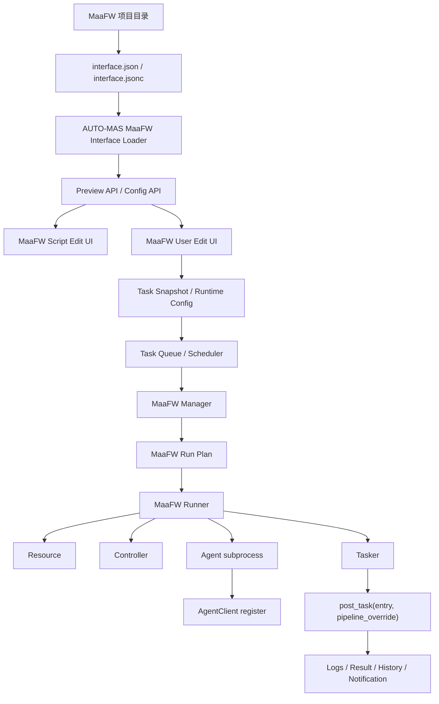

# MaaFW 整体适配方案与项目报告

日期：2026-06-24

范围：AUTO-MAS 内置 MaaFramework Project Interface V2 通用适配、Python/Agent 环境隔离、`D:\maafwin` 本地脚本包盘点、MFW / MFAAvalonia / MXU 兼容性判断、当前实现状态与测试结论。

## 1. 结论摘要

本轮 MaaFW 适配的核心结论是：AUTO-MAS 应当作为 MaaFramework Client 直接消费 `interface.json`、resource、agent、task、preset 和 option，而不是把 MFW-PyQt6、MFAAvalonia、MXU 等通用 GUI 壳作为子程序驱动。

`argument 1: OverflowError: int too long to convert` 的直接风险来自 Python Agent 环境被串进 AUTO-MAS 主进程：外部 MaaFW 项目的 `maa.agent.agent_server` 一旦在 AUTO-MAS 进程内导入，会把 `maa.library.Library` 切到 AgentServer 模式，随后 AUTO-MAS 主进程里的 `Resource`、`Tasker` 析构或 stop 调用会落到错误的 native library 上下文，最终触发 ctypes 参数转换异常。

因此，适配方案必须坚持一个边界：

- AUTO-MAS 主进程只做 MaaFW Client。
- 外部 Agent 一律通过 socket 子进程连接。
- 即使上游 `interface.json` 声明 `agent.embedded: true`，AUTO-MAS 也不在主进程内 import 该 Agent。
- Python 运行环境按项目隔离，不能让 AUTO-MAS `.venv` 和 MaaFW release 的 Python 互相污染。

当前实现已经完成以下关键改动：

- embedded Python Agent 转换为隔离子进程执行。
- 缺少项目自带 `python/python.exe` 时创建或复用项目专属 venv，且不回退到 AUTO-MAS 的 `sys.executable` 直接运行。
- 项目自带 Python 只做健康检查，不自动 pip install，不修改 release 目录。
- 项目内二进制 Agent，例如 `agent.exe`、`go-service.exe`、`cpp-algo.exe`，识别为 `project_binary`，不走 Python 环境准备。
- 前端准备环境结果展示 runtime kind、隔离 venv 路径和 fallback 原因。
- 修复 Windows 下 `agent/go-service`、`agent/cpp-algo` 无 `.exe` 后缀时的解析问题。
- ADB controller 创建前增加 `get-state` 就绪检查，提前识别 `offline` / `unauthorized`，避免把模拟器连接问题误判为任务或 Agent 问题。
- isolated venv 的 manifest 未变化时跳过 `pip install`，减少每次启动时的重复安装日志。
- 修复脚本页 Resource/Controller 没有继承进运行计划的问题；用户级 MaaFW Resource/Controller 属于历史遗留，运行时以脚本页配置优先。
- 修复停止或取消后后台 MaaFW 执行线程继续投递后续 task 的问题。
- 雷电模拟器 ADB 地址改为使用模拟器管理的固定 serial：实例 0 为 `emulator-5554`，不再优先使用 VBox 监听端口 `127.0.0.1:5555`。

## 2. 目标与非目标

### 2.1 目标

本适配的目标是让 AUTO-MAS 能直接管理 MaaFramework Project Interface V2 项目：

1. 用户选择 MaaFW release 或项目目录。
2. AUTO-MAS 读取 `interface.json` 和 `import` 文件。
3. AUTO-MAS 展示 controller、resource、preset、task、option。
4. 用户在 AUTO-MAS 中维护任务队列和运行配置。
5. AUTO-MAS 后端创建 MaaFW `Resource`、`Controller`、`Tasker`。
6. AUTO-MAS 启动 external Agent 子进程并通过 `AgentClient` 注册。
7. AUTO-MAS 调用 `tasker.post_task(entry, pipeline_override)` 执行任务。
8. 日志、状态、失败、停止和历史记录都回流到 AUTO-MAS。

### 2.2 非目标

本轮不做以下事情：

1. 不把 MFW-PyQt6 / MFAAvalonia / MXU 作为 AUTO-MAS 子进程 GUI 来驱动。
2. 不在 AUTO-MAS 主进程内 import 外部项目的 Python Agent。
3. 不把 AUTO-MAS 的 `.venv` 当成 MaaFW 项目的默认 Agent Python。
4. 不自动修改用户 release 目录中的项目 Python 依赖。
5. 不手改 `frontend/src/api/**` 下的 OpenAPI 生成文件。
6. 不把非 MaaFW PI 项目强行塞进 MaaFW 通用适配。

## 3. 故障根因分析

### 3.1 现场错误

用户提供的错误日志：

```text
MaaFW 任务执行失败: argument 1: OverflowError: int too long to convert
argument 1: OverflowError: int too long to convert
停止 MaaFW tasker 准备重试失败: argument 1: OverflowError: int too long to convert
停止 MaaFW tasker 失败: argument 1: OverflowError: int too long to convert
```

Python 析构阶段也出现同类错误：

```text
Exception ignored in: <function Resource.__del__ ...>
ctypes.ArgumentError: argument 1: OverflowError: int too long to convert

Exception ignored in: <function Tasker.__del__ ...>
ctypes.ArgumentError: argument 1: OverflowError: int too long to convert
```

### 3.2 根因链路

根因链路如下：

1. Maa_bbb 的 `interface.json` 声明 `agent.embedded: true`。
2. 旧逻辑尝试在 AUTO-MAS 主进程内加载 embedded Agent。
3. Maa_bbb 的 `agent/main.py` 会导入 `maa.agent.agent_server.AgentServer`。
4. `maa.agent.agent_server` 导入后会把 `maa.library.Library` 切换到 AgentServer 模式。
5. AUTO-MAS 主进程中已有的 `Resource` / `Tasker` 属于 Client 侧语义。
6. Library 模式被污染后，Client 侧对象析构或 stop 时调用到错误的 native 入口。
7. native handle 被错误解释，ctypes 尝试转换超长整数参数，触发 `OverflowError: int too long to convert`。

### 3.3 修复原则

修复不是简单 catch 这个异常，而是阻断环境污染源：

- AUTO-MAS 不再把外部 Python Agent import 到主进程。
- `agent.embedded: true` 只作为上游 GUI 语义，不作为 AUTO-MAS 主进程嵌入依据。
- 如检测到残留 embedded 运行计划，runner 直接拒绝，并提示必须使用 isolated subprocess。
- 在必要的 MaaFW Client 操作前恢复或锁定 `maa.library.Library` 的 client mode。

### 3.4 `start_app` 失败现场判断

2026-06-24 的 Maa_bbb v1.12.8 现场日志中，Agent 已经成功启动，失败点发生在 controller：

```text
[MaaFW Controller] 失败: start_app
[MaaFW Tasker] 失败: 登录方式选择接口
[UnitBase.cpp] child return error
[argv.exec=.../adb.exe]
[argv.args=["-s","127.0.0.1:5555","shell","monkey -p com.miHoYo.enterprise.NGHSoD 1"]]
```

这类失败和 `OverflowError` 的根因不同。它表示 MaaFW 已经进入 ADB controller 的启动应用阶段，但 ADB 命令没有成功执行。现场 `adb devices` 显示：

```text
127.0.0.1:5555 offline
```

因此当次 `TaskDetail(entry='登录方式选择接口')` 失败的直接原因是 ADB 设备未就绪。处理顺序应为：

1. 等待或重启模拟器，直到 `adb devices` 中目标设备状态为 `device`。
2. 如仍为 `offline`，执行 `adb kill-server` / `adb start-server` 后重新连接模拟器。
3. 状态为 `device` 后再检查安装包名与 resource 是否匹配。
4. 官服 resource 对应 `com.miHoYo.enterprise.NGHSoD`；如果实际安装的是 B 服或渠道服，需要选择对应 resource。

雷电模拟器的 ADB serial 不再使用 `127.0.0.1:5555` 这类 VBox 监听端口，而是使用雷电默认设备名：

```text
实例 0 -> emulator-5554
实例 1 -> emulator-5556
实例 2 -> emulator-5558
```

复查后又确认一个 AUTO-MAS 侧配置继承问题：配置文件中脚本页已保存 `Resource: 应用宝渠道服`，但用户级历史遗留字段 `Info.Resource` 为空。旧逻辑只读用户级字段，空值时自动回退到 interface 第一个 ADB resource，也就是“官服”，所以实际只加载：

```text
D:\maafwin\Maa_bbb-win-x86_64-v1.12.8\resource\base
```

这会导致 MaaFW 最终仍执行官服包名：

```text
com.miHoYo.enterprise.NGHSoD
```

修复后 Resource/Controller 选择规则为：脚本页配置优先，用户级历史遗留值仅在脚本页为空时兜底。

## 4. Python 与 Agent 环境隔离方案

### 4.1 运行时分类

当前 Agent 运行时分为四类：

| runtimeKind | 含义 | 处理策略 |
| --- | --- | --- |
| `project_python` | 项目自带 Python，例如 `<project>/python/python.exe` | 使用项目 Python，只做健康检查，不自动装包 |
| `isolated_venv` | AUTO-MAS 为该 MaaFW 项目创建的专属 venv | 使用项目 requirements 安装依赖，venv 放在 AUTO-MAS `config/maafw_agent_venvs/` |
| `project_binary` | 项目自带二进制 Agent，例如 `agent.exe`、`go-service.exe` | 直接启动，不走 Python pip/venv 逻辑 |
| `external` | 用户自备命令，例如 `python` | 视为外部环境，不自动准备依赖 |

历史上还存在 `embedded`，但当前方案中 `embedded` 不作为可运行 runtime。上游声明 embedded 时，AUTO-MAS 会转换为 isolated subprocess，最终运行计划中的 `embedded` 固定为 `false`。

### 4.2 `project_python`

适用场景：

- `interface.json` 声明 `child_exec: "./python/python.exe"`。
- 项目目录内真实存在 `python/python.exe`。

处理方式：

1. 使用 release 自带 Python 作为 Agent 解释器。
2. 不运行 `pip install`。
3. 不运行 `ensurepip`。
4. 不升级 `maafw`。
5. 只检测 pip 基础健康状态。
6. 健康检查失败时提示用户重新下载 release 或手动修复项目 Python。

原因：

- release 自带 Python 属于外部项目的一部分。
- 自动装包会持久修改用户 release 目录。
- 不同 MaaFW 项目可能要求不同 maafw / numpy / onnxruntime / cv 依赖组合。

### 4.3 `isolated_venv`

适用场景：

- 项目声明了 `python/python.exe`，但 release 目录里没有该文件。
- 项目目录存在 `agent/main.py`。
- 典型例子：`D:\maafwin\Maa_bbb-win-x86_64-v1.12.5`、`D:\maafwin\Maa_bbb-win-x86_64-v1.12.8`。

处理方式：

1. 根据项目绝对路径计算 hash。
2. 在 AUTO-MAS 工作目录下创建：

   ```text
   config/maafw_agent_venvs/maafw_venv_<hash>
   ```

3. 用 AUTO-MAS 当前 Python 引导创建 venv，但实际 Agent 在该 venv 中运行。
4. 依赖来源只读取 MaaFW 项目自己的 `requirements.txt`。
5. 不读取 AUTO-MAS `requirements.txt`。
6. 不把 AUTO-MAS `.venv` 暴露给 Agent。
7. 根据项目 `requirements.txt` 和 `interface.json` 写 manifest；项目变更时重建 venv。
8. manifest 未变化时跳过 `pip install`，仅保留 pip 健康检查。

隔离环境清理的关键变量：

```text
VIRTUAL_ENV
PYTHONHOME
PYTHONUSERBASE
PIP_TARGET
PIP_PREFIX
PIP_USER
PYTHONPATH
```

其中 `PYTHONPATH` 会重新设置为 MaaFW 项目根目录，不继承 AUTO-MAS 的 Python path。

### 4.4 `project_binary`

适用场景：

- `interface.json` 声明的是项目内可执行文件。
- 示例：

  ```json
  {
    "child_exec": "agent/go-service",
    "child_args": []
  }
  ```

本地 Windows release 里实际文件可能是：

```text
agent/go-service.exe
agent/cpp-algo.exe
agent/agent.exe
```

处理方式：

1. 先按原路径解析。
2. Windows 下如果路径没有后缀且原文件不存在，尝试补 `.exe`。
3. 补后缀仍必须校验路径在项目根目录内。
4. 真实存在则标记为 `project_binary`。
5. 直接启动，不做 Python 环境准备。

这修复了 MaaEnd 这类项目被误报为 agent 不存在的问题。

### 4.5 禁止回退到 AUTO-MAS `sys.executable`

缺少项目 Python 时，不再把 `sys.executable` 当成最终解释器直接运行 Agent。

原因：

- `sys.executable` 指向 AUTO-MAS `.venv`。
- 直接用它运行外部 Agent 会污染 AUTO-MAS 依赖环境。
- 外部 Agent 也可能 import 到 AUTO-MAS 已安装的 maafw 版本，引发与 release 不一致的问题。

允许的做法是：

- 用 `sys.executable` 仅作为 venv 创建工具。
- Agent 实际运行在项目专属 isolated venv 中。

## 5. `D:\maafwin` 本地脚本盘点

### 5.1 顶层目录

本地 `D:\maafwin` 发现的主要目录：

```text
BetterGI
BGI-0.61.2
chromedriver-win64
M9A
M9A-win-x86_64-v3.10.4
M9A-win-x86_64-v3.20.1
MAA-v5.18.3-win-x64
MaaEnd-win-x86_64-v1.16.0-beta.1
MaaFramework
MaaYYs-win-x86_64-v3.10.2
Maa_bbb
Maa_bbb-win-x86_64-v1.10.9
Maa_bbb-win-x86_64-v1.12.5
Maa_bbb-win-x86_64-v1.12.8
March7thAssistant-v2026.4.27
StarRailAssistant-v2.16.1
```

### 5.2 MaaFW PI 候选目录

以下目录存在可解析的 `interface.json`：

| 路径 | 项目 | PI | 适配判断 |
| --- | --- | --- | --- |
| `D:\maafwin\Maa_bbb-win-x86_64-v1.10.9` | MAA_bbb | PI V2 | 可走 MaaFW 通用适配 |
| `D:\maafwin\Maa_bbb-win-x86_64-v1.12.5` | MAA_bbb | PI V2 | 可走 MaaFW 通用适配，需 isolated venv |
| `D:\maafwin\Maa_bbb-win-x86_64-v1.12.8` | MAA_bbb | PI V2 | 可走 MaaFW 通用适配，需 isolated venv |
| `D:\maafwin\Maa_bbb\assets` | MAA_bbb 源码资源 | PI V2 | 可解析，不建议作为普通 release 入口 |
| `D:\maafwin\M9A-win-x86_64-v3.10.4` | M9A | PI V2 | 可走 MaaFW 通用适配；完整产品体验仍建议 M9A 专项 |
| `D:\maafwin\M9A-win-x86_64-v3.20.1` | M9A | PI V2 | 可走 MaaFW 通用适配；完整产品体验仍建议 M9A 专项 |
| `D:\maafwin\M9A\assets` | M9A 源码资源 | PI V2 | 可解析，不建议作为普通 release 入口 |
| `D:\maafwin\MaaEnd-win-x86_64-v1.16.0-beta.1` | MaaEnd | PI V2 / MXU 线 | MaaFW 通用可执行；完整配置体验建议 MaaEnd 专项 |
| `D:\maafwin\MaaYYs-win-x86_64-v3.10.2` | MaaYYs | PI V2 | 可走 MaaFW 通用适配 |
| `D:\maafwin\MaaFramework\sample` | 官方 sample | PI V2 | 适合作为测试样本，不建议作为产品脚本 |

以下是资源或更新解压副本，不作为独立脚本根目录：

```text
D:\maafwin\Maa_bbb-win-x86_64-v1.10.9\temp\temp_res\resource_v1.12.5_extracted
D:\maafwin\M9A-win-x86_64-v3.10.4\temp_res\resource_v3.22.0_extracted
D:\maafwin\M9A-win-x86_64-v3.20.1\temp_res\resource_v3.22.0_extracted
```

### 5.3 MaaFW 候选解析结果

本地抽样解析结果：

| 项目目录 | name | version | controllers | resources | tasks | Agent |
| --- | --- | --- | ---: | ---: | ---: | --- |
| `Maa_bbb-win-x86_64-v1.10.9` | `MAA_bbb` | `v1.12.8` | 2 | 10 | 36 | `project_python`, `python/python.exe` 存在 |
| `Maa_bbb-win-x86_64-v1.12.5` | `MAA_bbb` | `v1.12.5` | 2 | 10 | 36 | `isolated_venv`, 项目 Python 缺失 |
| `Maa_bbb-win-x86_64-v1.12.8` | `MAA_bbb` | `v1.12.8` | 2 | 10 | 36 | `isolated_venv`, 项目 Python 缺失 |
| `M9A-win-x86_64-v3.20.1` | `M9A` | `v3.22.0` | 3 | 9 | 21 | `project_python`, `python/python.exe` 存在 |
| `MaaEnd-win-x86_64-v1.16.0-beta.1` | `MaaEnd` | `v2.16.0` | 5 | 1 | 39 | `project_binary`, `go-service.exe` + `cpp-algo.exe` |
| `MaaYYs-win-x86_64-v3.10.2` | `MaaYYs` | `v3.10.2` | 1 | 8 | 27 | `project_binary`, `agent.exe` |

### 5.4 非 MaaFW PI 项目

| 路径 | 类型判断 | 建议适配线 |
| --- | --- | --- |
| `D:\maafwin\StarRailAssistant-v2.16.1` | 独立 `SRA.exe` / `SRA-cli.exe`，未发现 PI `interface.json` | General 起步或后续 SRC/专项目标 |
| `D:\maafwin\March7thAssistant-v2026.4.27\March7thAssistant_full` | 独立 GUI/CLI，YAML 配置、工作流配置 | General 起步，按 CLI 和 YAML 配置专项化 |
| `D:\maafwin\BetterGI` | 独立 BetterGI GUI，`User/config.json`、大量内置任务资源 | BetterGI 专项或 General 起步，不走 MaaFW |
| `D:\maafwin\MAA-v5.18.3-win-x64` | 官方 MAA release，已有 MAA 生态配置 | 走现有 MAA 适配，不走 MaaFW 通用 PI |
| `D:\maafwin\BGI-0.61.2` | BetterGI installer | 不作为脚本根目录 |
| `D:\maafwin\chromedriver-win64` | 浏览器驱动 | 不作为脚本 |

## 6. MFW / MFAAvalonia / MXU 兼容性解释

### 6.1 兼容的含义

MFW-PyQt6、MFAAvalonia、MXU 都可以被称为 MaaFramework 通用 GUI 或 PI V2 客户端。但“兼容”主要指：

- 能读取 `interface.json`。
- 能理解 controller/resource/task/preset/option。
- 能启动或注册 Agent。
- 能控制 MaaFW task flow。
- 能提供 UI 配置和任务编排。

这不等于：

- 这些 GUI 的 embedded Agent 模式可以安全搬进 AUTO-MAS 主进程。
- 这些 GUI 的内部 Python/C#/Rust/Tauri 运行模型可以被 AUTO-MAS 直接复用。
- AUTO-MAS 应该启动这些 GUI 壳再通过窗口或配置文件间接控制。

### 6.2 MFW-PyQt6

MFW-PyQt6 的 README 说明：

- 支持 interface v2。
- 支持 `--direct-run`、`--force-restart`、`--config-id`。
- `CFA_setting.json` 中可以设置 `embedded: true`。
- embedded 模式会把 Agent 转成 custom 加载方式，使用 UI 内部环境运行。

关键判断：

- MFW 的 embedded 是 MFW 自己的转换层能力。
- AUTO-MAS 不能假设自己也能安全复用这套主进程内嵌语义。
- 对 AUTO-MAS 来说，MFW 兼容只证明项目 PI 可以被通用客户端消费，不证明可 in-process import。

### 6.3 MFAAvalonia

Maa_bbb README 中提到 MFAAvalonia：

- 基于 Avalonia 的 GUI。
- 内置 MaaFramework 直接控制任务流程。
- 曾经可作为 Maa_bbb 的图形界面。

关键判断：

- Avalonia 是 C#/.NET UI 壳。
- 它的兼容点是 MaaFramework PI/resource/task 流程。
- 它和 AUTO-MAS 的 Python 主进程不在同一个运行模型内。
- 不能因为 MFAAvalonia 兼容，就推导出 Python Agent 可以嵌入 AUTO-MAS。

### 6.4 MXU

MXU 的主要信号：

- Tauri + React + TypeScript。
- PI V2 通用 GUI。
- Rust 后端创建 socket id。
- 使用 `Command::new(child_exec)` 启动 child process。
- 通过 AgentClient 注册 sinks。

关键判断：

- MXU 使用的是子进程 Agent 模式。
- 这与 AUTO-MAS 当前设计一致。
- MXU 可以作为 PI 客户端行为参考，但不作为 AUTO-MAS 运行时依赖。

## 7. 总体架构方案

### 7.1 架构图



### 7.2 模块职责

| 模块 | 职责 |
| --- | --- |
| `interface_loader.py` | 读取 `interface.json` / `interface.jsonc`，合并 `import`，展开 `scan_select` |
| `interface_models.py` | 定义 PI V2 Pydantic 模型 |
| `task_config.py` | preset、task snapshot、默认选项、任务执行 payload 归一化 |
| `pipeline_override.py` | 按 PI 语义合并 global/resource/controller/task option |
| `run_plan.py` | 生成可执行计划，包括 resource、agent、PI env、task override |
| `runner.py` | 创建 MaaFW Resource/Controller/Tasker，启动 Agent，执行 task |
| `AutoProxy.py` / `manager.py` | 接入 AUTO-MAS 任务生命周期和多用户执行 |
| `app/api/scripts.py` | 提供 MaaFW interface preview、agent env prepare 等 API |
| `frontend/src/views/EditView/Script/MaaFWScriptEdit.vue` | 脚本级路径、更新、设备、Agent 环境准备入口 |
| `frontend/src/views/EditView/User/*` | 用户级 controller/resource/preset/task 配置 |

## 8. 运行流程设计

### 8.1 准备阶段

1. 用户选择 MaaFW 项目目录。
2. 后端校验目录存在。
3. loader 解析 `interface.json`。
4. loader 递归合并 `import`。
5. loader 展开 `scan_select`。
6. API 返回 preview 数据。
7. 前端展示项目名、版本、controller、resource、preset、task。
8. 用户保存脚本配置。
9. 用户创建用户配置并保存任务快照。

### 8.2 执行阶段

1. AUTO-MAS 调度队列分派 `MaaFWManager`。
2. Manager 加载脚本配置和用户配置。
3. 构造 `MaaFWRunPlan`。
4. RunPlan 选择 controller/resource。
5. RunPlan 根据 preset 或 task snapshot 选择任务。
6. RunPlan 为每个任务构造 `pipelineOverride`。
7. Runner 创建 MaaFW `Resource`。
8. Runner 加载 resource paths 和 controller attached resource paths。
9. Runner 创建 controller。
10. Runner 创建并绑定 `Tasker`。
11. Runner 根据 agent plans 启动 Agent 子进程。
12. Runner 等待 `AgentClient` 注册。
13. Runner 顺序执行任务。
14. 每个任务调用 `tasker.post_task(entry, pipeline_override)`。
15. Runner 捕获日志、回调和异常。
16. 停止或失败时执行 cleanup。

### 8.3 停止与清理

停止时执行：

1. 请求 `tasker.post_stop()`。
2. 停止当前 AgentClient。
3. 终止 Agent 子进程。
4. 释放 Tasker。
5. 释放 Resource。
6. 恢复 MaaFW client library mode。
7. 写入 AUTO-MAS 任务状态和日志。

## 9. API 与前端展示方案

### 9.1 API 输出字段

Agent 环境准备返回以下关键字段：

| 字段 | 含义 |
| --- | --- |
| `childExec` | `interface.json` 声明的 agent child_exec |
| `executable` | AUTO-MAS 实际使用的可执行文件 |
| `runtimeKind` | `project_python` / `isolated_venv` / `project_binary` / `external` |
| `isolatedVenvPath` | isolated venv 路径，仅 isolated venv 有值 |
| `fallbackReason` | fallback 或 embedded 转换原因 |

### 9.2 前端展示

前端展示策略：

- `project_python`：显示“项目自带 Python”。
- `isolated_venv`：显示“隔离 venv”并展示路径。
- `project_binary`：显示“项目自带程序”。
- `external`：显示“外部环境”。
- 存在 fallbackReason 时显示“准备说明”。

用户能直接看到为什么：

- embedded Agent 被切换为隔离子进程。
- 项目声明的 Python 不存在。
- AUTO-MAS 将使用项目专属 venv。

## 10. `D:\maafwin` 各项目适配建议

### 10.1 Maa_bbb

路径：

```text
D:\maafwin\Maa_bbb-win-x86_64-v1.10.9
D:\maafwin\Maa_bbb-win-x86_64-v1.12.5
D:\maafwin\Maa_bbb-win-x86_64-v1.12.8
```

特点：

- `interface.json` 是 PI V2。
- controller 包含桌面端 Win32 和安卓端 ADB。
- resource 包含官服、B 服、渠道服、桌面键鼠等。
- task 数量约 36。
- preset 数量约 3。
- `CFA_setting.json` 和 `interface.json` 可声明 `embedded: true`。
- `agent/main.py` 实际仍是 `AgentServer.start_up(socket_id)` 模式。

适配策略：

- 不执行 in-process embedded。
- 统一转换为 isolated subprocess。
- v1.10.9 有 `python/python.exe`，使用 `project_python`。
- v1.12.5 / v1.12.8 缺 `python/python.exe`，使用 `isolated_venv`。
- Win32 端需注意权限和窗口句柄。
- ADB 端优先通过 AUTO-MAS 模拟器配置取地址。

风险：

- v1.12.5 / v1.12.8 的 release 形态缺 Python，isolated venv 需要能从项目 requirements 安装依赖。
- 如果项目强依赖 MFW 内部转换层，AUTO-MAS 子进程模式仍需实机验证。

### 10.2 M9A

路径：

```text
D:\maafwin\M9A-win-x86_64-v3.10.4
D:\maafwin\M9A-win-x86_64-v3.20.1
```

特点：

- `interface.json` 是 PI V2。
- controller 包含 ADB、PC、PlayCover。
- resource 包含官服、B 服、渠道服、国际服。
- v3.20.1 解析到 21 个 task、4 个 preset。
- release 自带 `python/python.exe`。

适配策略：

- MaaFW 通用适配可以直接运行。
- Agent 使用 `project_python`。
- AUTO-MAS 现有 M9A 专项仍有价值，因为它承载 MFAA 线队列和项目特化配置。
- 若用户只想按 PI 任务执行，可走 MaaFW 通用。
- 若用户需要完整 M9A 产品体验，继续保留 M9A 专项。

风险：

- PC/Win32 执行需要真实窗口和权限确认。
- PlayCover 暂不作为 Windows 首要路径。
- 旧 M9A 专项配置与 MaaFW 通用 task snapshot 不同，迁移需要单独设计。

### 10.3 MaaEnd

路径：

```text
D:\maafwin\MaaEnd-win-x86_64-v1.16.0-beta.1
```

特点：

- PI V2 / MXU 线。
- controller 包含 Win32 front、Win32 background、ADB、PlayCover、Wlroots。
- task 数量约 39。
- Agent 声明为 `agent/go-service`、`agent/cpp-algo`。
- 本地真实文件为 `go-service.exe`、`cpp-algo.exe`。

适配策略：

- MaaFW 通用适配可以运行项目二进制 Agent。
- Windows 下自动补 `.exe`。
- runtimeKind 为 `project_binary`。
- 不做 Python venv。
- 完整配置体验建议继续走 MaaEnd/MXU 专项线。

风险：

- `interface.json` 声明无 `.exe`，必须保留 Windows 补后缀兼容。
- Wlroots 等非 Windows controller 不应在 Windows UI 中作为首选运行路径。

### 10.4 MaaYYs

路径：

```text
D:\maafwin\MaaYYs-win-x86_64-v3.10.2
```

特点：

- PI V2。
- controller 仅 Android ADB。
- resource 多渠道服。
- task 数量约 27。
- Agent 是 `.\agent\agent.exe`。
- release 内含 `mxu.exe` 和 `maafw\MaaPiCli.exe`。

适配策略：

- MaaFW 通用适配可运行。
- Agent 标记为 `project_binary`。
- 重点验证 ADB 设备配置和渠道服 resource 选择。

风险：

- 任务成功语义可能需要通过日志进一步判定。
- 目前只做通用 PI，未做项目特化 UI。

### 10.5 StarRailAssistant

路径：

```text
D:\maafwin\StarRailAssistant-v2.16.1
```

特点：

- 独立 `SRA.exe`、`SRA-cli.exe`。
- README 描述为崩坏星穹铁道自动化助手。
- 未发现 PI `interface.json`。

适配策略：

- 不走 MaaFW 通用。
- 可先用 General 验证 exe/CLI 启动。
- 如 CLI 能明确指定任务和退出行为，再做专项。

### 10.6 March7thAssistant

路径：

```text
D:\maafwin\March7thAssistant-v2026.4.27\March7thAssistant_full
```

特点：

- 独立 GUI、Launcher、Updater。
- README 提到图形界面、命令行帮助、YAML 配置。
- `assets/config/config.example.yaml` 和 workflows 是关键配置面。
- 未发现 PI `interface.json`。

适配策略：

- 不走 MaaFW 通用。
- General 起步，确认命令行参数。
- 后续若专项化，应围绕 YAML 配置和 workflow 设计表单。

### 10.7 BetterGI

路径：

```text
D:\maafwin\BetterGI
```

特点：

- 独立 BetterGI GUI。
- 有 `BetterGI.exe`、`User/config.json`、大量 GameTask 和 Assets。
- 未发现 PI `interface.json`。

适配策略：

- 不走 MaaFW 通用。
- 如果要适配，应作为 BetterGI 专项或 General 启动型脚本。

### 10.8 MAA

路径：

```text
D:\maafwin\MAA-v5.18.3-win-x64
```

特点：

- 官方 MAA release。
- 有 `MAA.exe`、`MAA.Updater.exe`、`config/gui.json`、resource tasks。
- 不是 MaaFW PI 通用包。

适配策略：

- 走现有 MAA 线。
- 不作为 MaaFW 通用适配对象。

## 11. 当前代码改动清单

当前工作区涉及文件：

```text
app/api/scripts.py
app/models/schema.py
app/task/MaaFW/run_plan.py
app/task/MaaFW/runner.py
frontend/src/types/script.ts
frontend/src/views/EditView/Script/MaaFWScriptEdit.vue
tests/test_maafw_interface_loader.py
docs/dev/maafw-overall-adaptation-report-2026-06-24.md
```

核心变化：

1. `run_plan.py`
   - embedded agent 转 isolated subprocess。
   - 缺项目 Python 时使用 isolated venv。
   - Windows 项目内可执行文件支持补 `.exe`。
   - 新增 `project_binary` 分类。

2. `runner.py`
   - 增加 MaaFW client library mode 恢复。
   - 拒绝 residual embedded runtime plan。
   - Agent env 清理 AUTO-MAS Python 环境变量。
   - isolated venv 只安装项目 requirements。

3. `schema.py` / `scripts.py`
   - Agent 环境准备响应增加 fallbackReason。
   - executable 描述改为通用可执行文件。

4. `frontend/src/types/script.ts`
   - 前端类型补充 fallbackReason。

5. `MaaFWScriptEdit.vue`
   - 展示 Agent runtime kind。
   - 展示 isolated venv 路径。
   - 展示 fallback / embedded 转换说明。
   - 支持 `project_binary` 标签。

6. `tests/test_maafw_interface_loader.py`
   - 覆盖 embedded 转 isolated subprocess。
   - 覆盖不回退 AUTO-MAS `sys.executable`。
   - 覆盖 project Python。
   - 覆盖 Windows `.exe` 后缀二进制 Agent。
   - 覆盖 MaaFW client library mode 恢复。
   - 覆盖 isolated venv manifest 和 requirements 行为。
   - 覆盖 ADB offline 提前报错。
   - 覆盖 manifest 未变化时跳过 `pip install`。
   - 覆盖脚本页 Resource 优先于用户级历史遗留 Resource。
   - 覆盖停止后不继续投递后续 MaaFW task。
   - 覆盖雷电模拟器优先返回 `emulator-5554` 固定 serial。

## 12. 测试报告

### 12.1 已通过命令

MaaFW 重点测试：

```powershell
.\.venv\Scripts\python.exe -m pytest tests\test_maafw_interface_loader.py -q
```

结果：

```text
45 passed, 6 skipped
```

Python 编译检查：

```powershell
.\.venv\Scripts\python.exe -m py_compile app\task\MaaFW\runner.py app\task\MaaFW\run_plan.py app\api\scripts.py app\models\schema.py
```

结果：通过。

前端针对文件 lint：

```powershell
yarn eslint src/views/EditView/Script/MaaFWScriptEdit.vue src/types/script.ts
```

结果：通过。

空白检查：

```powershell
git diff --check
```

结果：通过，仅有工作区 LF/CRLF 提示。

本地 MaaFW 包解析抽样：

```text
Maa_bbb v1.10.9: project_python
Maa_bbb v1.12.5: isolated_venv
Maa_bbb v1.12.8: isolated_venv
M9A v3.20.1: project_python
MaaEnd v1.16.0-beta.1: project_binary
MaaYYs v3.10.2: project_binary
```

### 12.2 非阻塞失败

全量前端 lint：

```powershell
yarn lint
```

结果：失败。

失败原因是仓库既有无关文件存在大量 Prettier / unused-var 问题，典型文件包括：

```text
frontend/electron/ipc/fileHandlers.ts
frontend/electron/ipc/initializationHandlers.ts
frontend/src/utils/openExternal.ts
frontend/src/utils/scheduler-debug.ts
frontend/src/views/EditView/Script/GeneralScriptEdit.vue
```

本次触碰的 MaaFW 前端文件已通过针对性 lint。

### 12.3 尚未完成的实机验证

以下仍需实机或真实环境验证：

1. 真实 Android 设备或模拟器 ADB 执行 Maa_bbb / M9A / MaaYYs。
2. 真实 PC 游戏窗口 Win32 controller 执行。
3. Maa_bbb `embedded: true` 被转换为 isolated subprocess 后的完整任务成功率。
4. MaaEnd `go-service.exe` / `cpp-algo.exe` 在 AUTO-MAS 下完整注册和任务执行。
5. 项目业务成功/失败语义与 AUTO-MAS 历史结果的映射。
6. 更新流程中 release 包替换、增量包删除、isolated venv manifest 重建的端到端验证。

## 13. 风险与应对

### 13.1 Maa_bbb release Python 缺失

风险：

- v1.12.5 / v1.12.8 声明 `./python/python.exe`，但本地 release 缺该文件。
- 如果项目 requirements 不完整，isolated venv 可能无法完全复现 MFW 内部环境。

应对：

- 前端展示 fallbackReason。
- isolated venv 使用项目 requirements。
- 失败时给出项目路径、venv 路径和修复建议。
- 不污染 AUTO-MAS `.venv`。

### 13.2 embedded 语义差异

风险：

- MFW 的 embedded 是其私有转换层。
- AUTO-MAS 转子进程后，个别自定义 action/recognition 可能暴露隐藏依赖。

应对：

- 默认转 isolated subprocess。
- 保留 fallbackReason。
- 如某项目必须 embedded，后续单独设计安全沙箱，不放进 AUTO-MAS 主进程。

### 13.3 多 GUI 兼容概念混淆

风险：

- 用户看到 MFAAvalonia/MXU/MFW 兼容 MaaFW，容易理解为 AUTO-MAS 也能直接嵌入这些运行模型。

应对：

- 文档明确兼容是 PI 协议兼容。
- AUTO-MAS 的运行边界是 client + socket agent subprocess。

### 13.4 项目内二进制 Agent

风险：

- `interface.json` 可能省略 Windows `.exe`。
- 旧解析会误报不存在。

应对：

- Windows 下对项目内 executable 自动尝试 `.exe`。
- 仍做 base_dir 边界校验。

### 13.5 全量前端 lint 噪声

风险：

- 全量 lint 失败会影响后续合并判断。

应对：

- 本次只认定 touched files targeted lint。
- 后续单独清理前端全量 Prettier/unused-var 噪声。

### 13.6 ADB offline 与渠道 resource 不匹配

风险：

- 模拟器刚启动时，`adb devices` 可能短时间显示 `offline`。
- controller `start_app` 失败会导致首个任务节点失败，表现为 `TaskDetail(entry='登录方式选择接口')`。
- Maa_bbb 不同 resource 对应不同渠道包名，resource 选错时即使 ADB ready 也无法启动目标包。

应对：

- controller 创建前执行 ADB `get-state` 重试检查。
- 只有状态为 `device` 才继续创建 ADB controller。
- 错误信息提示用户检查 `adb devices` 状态不能是 `offline` / `unauthorized`。
- 实机验证时记录每个 resource 对应包名，优先在 UI 或文档中给出推荐选择。

## 14. 分阶段落地计划

### P0：环境隔离与崩溃修复

状态：已完成。

内容：

- embedded 转 isolated subprocess。
- 不回退 AUTO-MAS `sys.executable`。
- 清理 Agent env。
- 恢复 MaaFW client library mode。
- project binary runtime 分类。
- Windows `.exe` 解析。

验收：

- `OverflowError` 不再由主进程 import `maa.agent.agent_server` 触发。
- 测试覆盖 `Library.is_agent_server()` 恢复。
- MaaFW 重点测试通过。

### P1：通用 MaaFW PI 执行链路

状态：主体已落地，仍需实机验证。

内容：

- interface loader。
- run plan。
- resource/controller/tasker 创建。
- AgentClient 子进程注册。
- task 顺序执行。
- cleanup。

验收：

- M9A / Maa_bbb / MaaYYs / MaaEnd 的 interface 可解析。
- 至少一个 ADB 项目可完整执行任务。
- 至少一个 Win32 项目可连接真实窗口并执行任务。

### P2：前端可解释环境准备

状态：已完成。

内容：

- 前端展示 runtime kind。
- 展示 isolated venv。
- 展示 fallbackReason。
- `project_binary` 标签。

验收：

- 用户能看懂 Maa_bbb 为什么用了 isolated venv。
- 用户能看懂 MaaEnd 为什么是项目自带程序。
- 目标文件 eslint 通过。

### P3：项目适配分流

状态：建议执行。

策略：

- Maa_bbb、MaaYYs：优先走 MaaFW 通用适配。
- M9A：保留 M9A 专项，同时允许 MaaFW 通用执行。
- MaaEnd：保留 MaaEnd/MXU 专项，同时允许 MaaFW 通用执行。
- StarRailAssistant、March7thAssistant、BetterGI、MAA：不走 MaaFW 通用，分别走 General/专项/现有 MAA。

### P4：实机验证与业务成功判定

状态：待执行。

内容：

- ADB 设备真实运行。
- Win32 窗口真实运行。
- 采集 callback / log。
- 定义 MaaFW task 业务成功/失败映射。
- 失败时给用户可操作提示。

### P5：长期收敛

状态：待决策。

内容：

- 是否把 M9A 专项逐步迁移到 MaaFW 通用。
- 是否为 Maa_bbb 做专项 UI。
- 是否把 MaaEnd 通用执行能力与 MaaEnd 专项配置能力合并。
- 是否提供脚本架构自动识别和推荐适配线。

## 15. 推荐决策

### 15.1 技术边界

建议正式确定：

```text
AUTO-MAS MaaFW adapter = MaaFW Client + socket Agent subprocess
```

不支持：

```text
AUTO-MAS 主进程 in-process import 外部 MaaFW Python Agent
```

### 15.2 用户可见策略

建议在 UI 中继续使用：

- 技术类型：`MaaFW`
- 用户可见名称：`MaaFramework 项目`
- Agent 环境描述：`Agent 运行环境`

避免在 UI 中承诺：

- embedded 主进程运行。
- 自动修复 release Python。
- 自动兼容所有 GUI 壳内部配置。

### 15.3 脚本入口推荐

对 `D:\maafwin` 当前目录，推荐用户选择：

| 目标 | 推荐入口 |
| --- | --- |
| Maa_bbb v1.12.8 | `D:\maafwin\Maa_bbb-win-x86_64-v1.12.8` |
| Maa_bbb 稳定验证 | `D:\maafwin\Maa_bbb-win-x86_64-v1.10.9`，因为有项目 Python |
| M9A | `D:\maafwin\M9A-win-x86_64-v3.20.1` |
| MaaEnd 通用 PI 执行 | `D:\maafwin\MaaEnd-win-x86_64-v1.16.0-beta.1` |
| MaaYYs | `D:\maafwin\MaaYYs-win-x86_64-v3.10.2` |

不推荐作为 MaaFW 项目入口：

```text
D:\maafwin\Maa_bbb
D:\maafwin\M9A
D:\maafwin\*\temp_res\*
D:\maafwin\StarRailAssistant-v2.16.1
D:\maafwin\March7thAssistant-v2026.4.27
D:\maafwin\BetterGI
D:\maafwin\MAA-v5.18.3-win-x64
```

## 16. 后续检查清单

执行合并或继续开发前建议检查：

1. `tests/test_maafw_interface_loader.py` 保持通过。
2. `MaaFWScriptEdit.vue` 和 `script.ts` targeted eslint 保持通过。
3. 新增 API 字段如需进入生成客户端，必须通过 OpenAPI 生成器，不手改 `frontend/src/api/**`。
4. 对 v1.12.8 isolated venv 做一次干净环境重建验证。
5. 对 MaaEnd project binary 做一次真实 AgentClient 注册验证。
6. 对 MaaYYs ADB 做一次真实任务验证。
7. 对 Maa_bbb Win32 做一次真实窗口权限验证。
8. 对 Maa_bbb Android 先确认 `adb devices` 为 `device`，再验证官服/B服/渠道服 resource 与包名匹配。
9. 记录每个项目的推荐 controller/resource/preset 初始值。
10. 将 full frontend lint 的既有噪声作为单独任务处理。

## 17. 当前状态

本报告基于当前工作区未提交改动整理。当前尚未创建 commit 或 push。

已验证的结论可以作为本轮 MaaFW 适配的工程基线：

- 根因明确：主进程导入 AgentServer 污染 MaaFW library mode。
- 运行边界明确：AUTO-MAS Client + Agent 子进程。
- 环境隔离明确：project_python / isolated_venv / project_binary / external。
- 本地脚本分类明确：哪些走 MaaFW 通用，哪些走专项或 General。
- 测试覆盖到关键隔离和解析行为。
