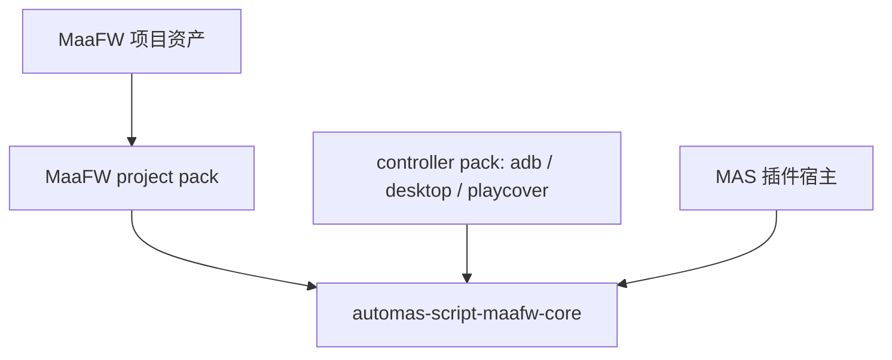
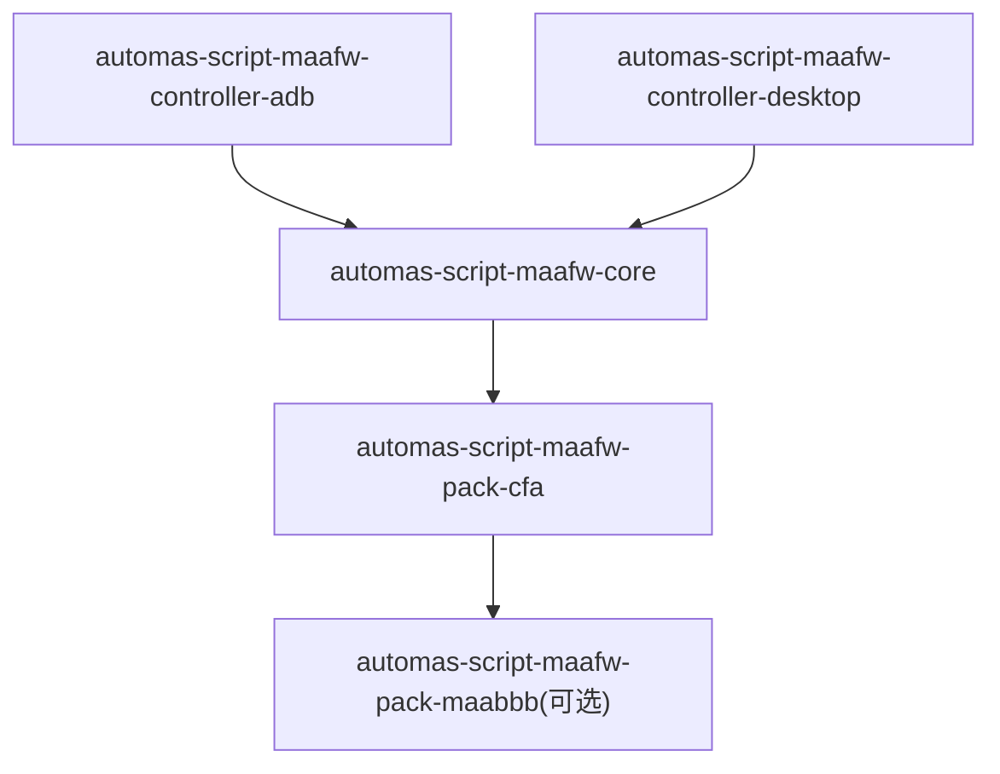
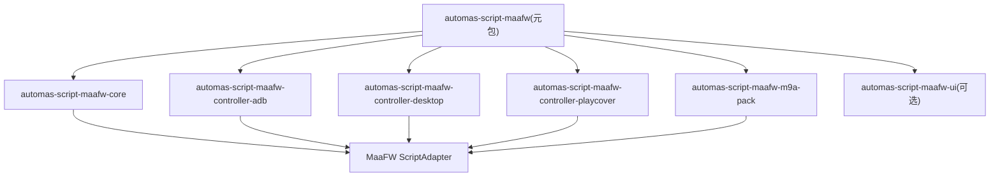

# MaaFW 插件化与 M9A 专项适配背景文档

日期：2026-06-25

本文用于统一当前 `feat/maafw` 改动的插件化方向，目标是把 M9A / MaaFW 的专项能力放进已有插件生态里，而不是把当前分支再做成一个新的大一体化内置类型。

## 结论

1. M9A 可以基于 MaaFW 插件组做专项适配，而且应该这么做。
2. 模拟器能力和 PC 能力建议拆成两个互斥的控制器插件族，不要继续塞进一个巨型脚本类型里。
3. MaaFW 的主适配应保持“薄壳”，核心运行、任务计划、更新、预览、窗口、控制器选择都应尽量下沉到插件服务或插件包。
4. 现有 PyPI 插件生态已经说明了正确方向：主插件负责编排，通道/能力/工具拆成独立插件，不必重复造轮子。

## 已有插件生态

从用户提供的 PyPI 列表和可读 JSON 元数据看，已有插件已经形成了几类稳定模式：

| 包 | 角色 | 启示 |
| --- | --- | --- |
| `automas-script-maa` | MAA 专项适配 | 说明“脚本专项 = 可独立发布的插件包”这条路已经成立。 |
| `automas-notification` | 通知编排服务 | 主服务只编排 `notify`，不内置所有发送细节。 |
| `automas-notification-*` | 通知通道插件 | 邮件、ServerChan、Webhook、OneBot、Koishi 等都应独立成通道。 |
| `automas-notification-test` | 通道测试插件 | 说明按钮动作型插件也可以独立发布。 |
| `automas-plugin-kill-process` | 工具型插件 | 说明插件不一定是脚本类型，也可以是事件/工具能力。 |
| `automas-background` | 非脚本 UI 插件 | 说明插件体系已经可以承载界面类扩展。 |

### 直接结论

- 不要把 MaaFW 做成“再造一个大内置脚本类型”。
- 应该把它做成“一个主编排包 + 多个能力包 + 一个专项包”的组合。
- M9A 只需要挂在这个组合上做专项规则，不需要复制 MaaFW 的所有通用能力。

## 要不要按 MXU / MWU / MFAA / CFA(MFW) 区分插件

要区分，但区分的是“项目包”，不是“核心运行时”。

当前文档里的名词映射按下面理解：

- `MXU`：MaaEnd / MXU 这条线。
- `MWU`：`ravizhan/MWU`。
- `MFAA`：M9A / MFAAvalonia 这条线。
- `CFA`：`MFW`。

### 推荐分类方式

1. **共享核心层**
   - 只放 MaaFW 通用的 interface 解析、run plan、agent、更新、控制器抽象。
   - 这一层不按 MXU / MWU / MFAA / CFA(MFW) 切。

2. **控制器层**
   - 按能力拆，不按项目名拆。
   - 例如 ADB、Desktop、PlayCover 各自独立。

3. **项目包层**
   - 按 MXU / MWU / MFAA / CFA(MFW) 这类上游生态拆。
   - 每个项目包负责默认值、任务语义、队列、周期规则、资源映射、专属动作。

### 什么时候必须单独拆包

满足下面任意一条，就应该单独拆成项目包：

- `interface.json` 结构差异明显。
- controller 选择逻辑不同。
- 任务队列语义不同。
- 更新和 agent 运行模型不同。
- 需要独立的专项 UI。

### 什么时候不必单独拆包

如果只是：

- 默认值不同。
- 任务列表不同。
- 文案不同。
- 一两个 option 不同。

那就放在同一个核心里，通过项目包配置和默认值覆盖处理，不要再拆新核心。

## 前端能否通用

结论是：**前端可以共享大部分“组件原语”，但不能共享成一整套完全通用的单页。**

### 可以通用的部分

- 项目路径选择。
- interface 预览。
- controller / resource 下拉选择。
- 任务描述渲染。
- 资源图片预览。
- 通用 action 按钮。
- 基础字段表单。
- 一些通用的选项控件，如 input / select / checkbox / switch。

### 不要强行通用的部分

- 任务队列。
- 预设切换。
- 周期跳过逻辑。
- 特定任务分组和默认排序。
- 更新面板。
- agent 环境面板。
- 控制器特定的运行校验。
- 每个项目自己的说明布局和操作流。

### 实际建议

1. 做一个共享 UI 包，承载可复用组件。
2. 每个项目包保留自己的脚本页和用户页。
3. 共享页面壳，不共享全部交互逻辑。
4. 只在字段模型和交互语义完全一致时，才把页面进一步收敛。

## 当前代码已经给出的边界

`origin/release/v5.2.0-withplugin.0.0.1` 里的插件宿主已经具备这些能力：

- `app/plugins/script_adapter.py`
- `app/core/script_types.py`
- `app/models/plugin_script_config.py`
- `app/plugins/server.py`
- `app/plugins/service_registry.py`
- `frontend/src/views/EditView/Script/PluginScriptEdit.vue`
- `frontend/src/views/EditView/User/PluginUserEdit.vue`
- `frontend/src/components/SchemaForm.vue`
- `frontend/src/composables/useSchemaActionRunner.ts`

这意味着：

- 脚本类型可以通过 `ScriptAdapterPlugin` 挂进去。
- 配置可以走 `PluginScriptConfig` / `PluginUserConfig`。
- 前端可以走通用的 plugin 编辑页和 schema 表单。
- 插件 HTTP / WS / action 可以走 `PluginServerRegistry`。
- 插件服务可以用 `ServiceRegistry` 做编排。

## MaaFW 开发者如何直接接入 MAS 插件

先给结论：**插件分支已经有接入底座，但 MaaFW 专用的一键接入 SDK 还没有完全产品化。**

`release/v5.2.0-withplugin.0.0.1` 已经具备插件发现、插件生命周期、脚本适配、schema 表单、插件动作、HTTP / WS、服务注册和 PyPI 插件安装能力。开发者今天理论上可以基于 `ScriptAdapterPlugin` 自己写一个专项脚本插件；但如果目标是让普通 MaaFW 项目开发者“按 MaaFW QuickStarted 写完项目后，直接集成到 MAS 插件上”，还需要我们先提供 `maafw-core` 和 project pack 契约。

### 从 MaaFW QuickStarted 到 MAS 的映射

MaaFW QuickStarted 的核心产物不是 MAS 插件代码，而是一套 MaaFW 项目资源。MAS 插件化后应该这样承接：

| MaaFW 侧产物 | MAS 插件侧承接 |
| --- | --- |
| `interface.json` / ProjectInterfaceV2 | 由 `maafw-core` 解析，生成脚本 schema、资源列表、任务列表和运行计划。 |
| `resource/pipeline/*.json` | 仍作为 MaaFW 项目资源，由 `maafw-core` 或 project pack 指定项目路径。 |
| `resource/image/**` | 不复制到 MAS 核心，作为项目包资源或外部项目路径读取。 |
| `resource/model/ocr/**` | 不内置到 MAS，按项目包依赖或资源目录管理。 |
| `config/maa_option.json` | 映射为 MAS 的运行 / 调试配置，例如日志、绘制、错误截图等字段。 |
| 控制方式 | 交给 `maafw-controller-adb` / `maafw-controller-desktop` / `maafw-controller-playcover`。 |
| 通用 UI | 由 MAS 的 `PluginScriptEdit.vue`、`PluginUserEdit.vue`、`SchemaForm.vue` 和 MaaFW UI 组件层承接。 |
| 全代码集成 | 只有需要特殊生命周期或非标准执行逻辑时，才落到 `ScriptAdapterHooks`。 |

### 推荐给开发者的三档接入方式

#### 1. 零代码项目接入

适合标准 MaaFW 项目。

开发者只需要提供：

- MaaFW 项目仓库或本地项目路径。
- `interface.json`。
- `resource/pipeline`、`resource/image`、`resource/model` 等资源。
- 可选的默认 controller、默认资源、默认任务队列、更新源。

MAS 侧由 `automas-script-maafw-core` 提供“选择 MaaFW 项目路径 / 拉取项目 / 解析 interface / 生成任务 UI / 运行项目”的能力。这个模式不要求开发者发布 MAS 插件，只要求 MaaFW 项目本身符合 ProjectInterfaceV2。

#### 2. project pack 插件接入

适合 M9A、MXU、MWU、MFAA、CFA(MFW) 这类需要默认值、队列语义或专项 UI 的项目。

开发者发布一个轻量 PyPI 插件，例如：

- `automas-script-maafw-pack-m9a`
- `automas-script-maafw-pack-mxu`
- `automas-script-maafw-pack-mwu`
- `automas-script-maafw-pack-mfaa`
- `automas-script-maafw-pack-cfa`

插件仍通过 `auto_mas.plugins` 入口点被 MAS 发现，但它不应重复实现 MaaFW 运行器。它只向 `maafw.registry` 注册 project pack：

- 项目标识和展示名。
- 默认项目仓库 / 发布源 / 本地目录规则。
- 支持的 controller provider。
- 默认任务队列和任务分组。
- 周期规则、账号资源默认值、专项校验。
- 需要的 MaaFW UI 组件。

这应该是 M9A 专项稳定后的主路径。

#### 3. 完整 ScriptAdapter 插件接入

适合非标准 MaaFW 项目或需要接管生命周期的项目。

开发者可以使用插件分支已有脚手架：

```powershell
python scripts/plugin_tool.py --kind script-adapter --name <plugin_name> --description "<description>"
```

生成的插件通过 `pyproject.toml` 暴露入口点：

```toml
[project.entry-points."auto_mas.plugins"]
<plugin_name> = "<plugin_name>.plugin:Plugin"
```

插件类继承 `ScriptAdapterPlugin`，在 `build_script_adapters()` 里返回 `ScriptAdapterDefinition`，再通过 `ScriptAdapterHooks` 实现 `check / prepare / finalize / on_crash / run_auto_proxy / run_script_config / run_manual_review`。

这个方式现在底座已经支持，但不建议作为 MaaFW 普通项目的默认路径。否则每个 MaaFW 项目都会复制一份运行器、更新器、controller 处理和任务 UI，后面维护成本会很高。

### 我们还缺什么

为了让 MaaFW 开发者真正“直接集成到 MAS 插件”，还需要补齐这些稳定契约：

1. `maafw-core` 插件：解析 `interface.json`、生成 run plan、管理项目更新、运行 MaaFW 任务。
2. `maafw.registry`：给 controller pack 和 project pack 注册 provider。
3. `MaaFWProjectPackPlugin` 或等价轻量基类：让项目包只声明默认值和专项规则。
4. MaaFW UI 组件层：承接任务队列、任务 option、描述渲染、资源预览。
5. MaaFW 插件脚手架模板：区别于通用 `script-adapter` 模板，专门生成 project pack。
6. 兼容策略：插件缺失时旧配置只读保留，不能丢数据。

因此当前判断是：**MAS 插件系统有能力承接，MaaFW 专用能力还要从当前 `feat/maafw` 实现中抽出并固化为插件 SDK。**

## 从 0 开始基于 MAS 插件做一个 MaaFW 应用

先给结论：**从 0 做 MaaFW 应用时，第一步仍然是做一个标准 MaaFW 项目，第二步才是把它声明成 MAS 的 MaaFW project pack。** MAS 不应该替代 MaaFW 的项目结构，也不应该让每个应用都复制一份 MaaFW runner。

### 给应用作者的一页版

如果你是一个 MaaFW 应用作者，不要一开始就理解所有 MAS 插件细节。先按下面三句话理解：

1. **你真正要做的是一个 MaaFW 项目**：写 `interface.json`、`resource/**`、`agent/**`，让 MaaFW 本身能跑。
2. **MAS 插件不是你的自动化逻辑**：MAS 插件只负责把你的 MaaFW 项目装进 MAS，声明默认资源、默认任务队列、推荐控制器和 UI 提示。
3. **通用运行能力由 MAS 的 MaaFW 插件组提供**：`maafw-core` 负责跑 MaaFW，controller 插件负责连模拟器或窗口，通知插件负责发通知。

换成人话就是：

| 你看到的词 | 可以先理解成 |
| --- | --- |
| MaaFW 项目 | 真正的自动化项目，类似 Maa_bbb 的 `interface.json + resource + agent` |
| `maafw-core` | MAS 里的 MaaFW 运行器 |
| controller pack | MAS 里的设备 / 窗口驱动，如 ADB、Win32、PlayCover |
| project pack | 你的项目在 MAS 里的“说明书 + 默认配置 + 专项体验” |
| `ScriptAdapterPlugin` | 兜底全自定义插件，能用但不应作为普通 MaaFW 项目的长期形态 |

### 新项目最短路径

从零开始时，按这个顺序做最容易落地：

1. **先不管 MAS**，做出一个能被 MaaFW 识别的项目目录。
2. 在 MaaFW 工具链里跑通一个最小任务，例如“连接设备 -> 截图 -> 执行一个 pipeline”。
3. 用 MAS 的 MaaFW 零代码入口选择这个项目目录，验证 `interface.json`、controller、resource、task 都能被 MAS 读出来。
4. 如果只是自己用，到这里就够了，不需要发布 MAS 插件。
5. 如果要给其他 MAS 用户安装，才做 `automas-script-maafw-pack-<project>`。
6. 如果项目不走标准 MaaFW 运行模型，才考虑 `ScriptAdapterPlugin`。

这条路径里，普通应用作者第一阶段只需要关心一个仓库：

```text
my_maafw_project/
  interface.json
  agent/
    main.py
  resource/
    pipeline/
    image/
    model/
  requirements.txt
  README.md
```

等项目本体跑通后，再新增第二个仓库：

```text
automas-script-maafw-pack-myapp/
  pyproject.toml
  src/
    automas_script_maafw_pack_myapp/
      plugin.py
      defaults.py
      assets/
        icon.png
```

第一个仓库负责“怎么自动化”，第二个仓库负责“在 MAS 里怎么默认展示和默认运行”。

### 第一阶段只验收这 5 件事

不要第一天就写完整插件。先验收：

1. `interface.json` 能列出 controller、resource、task、preset。
2. `resource/pipeline` 里的一个最小 pipeline 能跑。
3. `agent/main.py` 能作为子进程启动。
4. ADB 或 Desktop 只选择一种先跑通。
5. MAS 能把项目读成一个 MaaFW 脚本，并能跑一条 smoke task。

这 5 件事跑通之后，再讨论 project pack、默认队列、周期规则、通知和更新。

### 今天能做和目标形态要分开

当前插件分支已经有 `ScriptAdapterPlugin`、插件 schema 表单、HTTP / WS / action、`PluginScriptConfig` / `PluginUserConfig`，所以“手写完整插件”是能做 PoC 的。

但从产品化角度，普通 MaaFW 应用不应该长期走手写完整插件。目标形态是：

- MAS 提供 `automas-script-maafw-core`。
- MAS 提供 `automas-script-maafw-controller-adb`、`desktop`、`playcover`。
- 应用作者只提供 `automas-script-maafw-pack-<project>`。

因此文档里的 `MaaFWProjectPackPlugin` 是目标 SDK 形态；如果它还没落地，先用 `ScriptAdapterPlugin` 做验证，后续再迁回 project pack。

### 总体分层



这四层的责任要分清：

| 层 | 责任 | 不应该做的事 |
| --- | --- | --- |
| MaaFW 项目资产 | `interface.json`、pipeline、image、model、agent、requirements | 不包含 MAS 插件宿主逻辑 |
| project pack | 默认值、推荐资源、任务队列、专项校验、项目文案 | 不重复实现 MaaFW runner |
| `maafw-core` | interface 解析、run plan、Agent 环境、更新、运行 MaaFW 任务 | 不绑定单个游戏项目 |
| controller pack | ADB、Desktop、PlayCover 等控制器能力 | 不注册新的脚本类型 |

### 0 到 1 的推荐流程

#### 1. 先做纯 MaaFW 项目

项目作者先按 MaaFW 的方式组织项目，不要一开始就写 MAS 插件：

```text
my_maafw_project/
  interface.json
  agent/
    main.py
  resource/
    pipeline/
    image/
    model/
  requirements.txt
  README.md
```

最低验收：

- `interface.json` 能被 MaaFW 工具解析。
- 至少有一个 controller、一个 resource、一个可运行 task。
- Agent 能在项目隔离 Python 或项目自带 Python 下启动。
- pipeline 路径、图片和模型引用都相对项目根目录可解析。

这一步的目标是证明“项目本体是 MaaFW 合法项目”。不要用 MAS 去兜底修复 MaaFW 项目结构问题。

#### 2. 决定 MAS 接入档位

| 接入档位 | 适合场景 | 产物 |
| --- | --- | --- |
| 零代码项目接入 | 私有项目、标准 MaaFW 项目、只需要选择路径运行 | 不发插件，只让用户在 MAS 里选择项目路径 |
| project pack | 公开项目、需要默认队列 / 默认资源 / 专项校验 / 项目 UI | `automas-script-maafw-pack-<project>` |
| 完整 ScriptAdapter | 非标准生命周期、非标准运行器、必须接管 check / prepare / run | 独立 `ScriptAdapterPlugin` |

新 MaaFW 应用默认选 project pack。只有项目不符合 MaaFW 标准接口时，才考虑完整 ScriptAdapter。

#### 3. 创建 project pack 包

推荐包名：

```text
automas-script-maafw-pack-<project>
```

推荐目录：

```text
automas-script-maafw-pack-myapp/
  pyproject.toml
  src/
    automas_script_maafw_pack_myapp/
      __init__.py
      plugin.py
      defaults.py
      migrations.py
      assets/
        icon.png
```

`pyproject.toml` 通过 MAS 插件入口点暴露：

```toml
[project.entry-points."auto_mas.plugins"]
maafw_pack_myapp = "automas_script_maafw_pack_myapp.plugin:Plugin"
```

依赖应尽量细：

```toml
dependencies = [
  "automas-script-maafw-core",
]

[project.optional-dependencies]
adb = ["automas-script-maafw-controller-adb"]
desktop = ["automas-script-maafw-controller-desktop"]
playcover = ["automas-script-maafw-controller-playcover"]
```

如果项目强依赖某一种控制器，可以把对应 controller 放进主依赖；如果只是可选支持，放进 optional extras。

#### 4. 声明 project pack 元数据

目标形态应该是轻量声明，不写 runner。伪代码如下：

```python
from automas_script_maafw_core import MaaFWProjectPackDefinition, MaaFWProjectPackPlugin


class Plugin(MaaFWProjectPackPlugin):
    def build_project_packs(self):
        return [
            MaaFWProjectPackDefinition(
                key="myapp",
                display_name="My MaaFW App",
                project_repo="https://github.com/example/my_maafw_project",
                interface_path="interface.json",
                supported_controllers=["adb", "desktop"],
                default_controller="adb",
                default_resource="官服",
                default_preset="日常",
                icon="assets/icon.png",
            )
        ]
```

这段是目标 SDK 形态。当前插件分支已经有 `ScriptAdapterPlugin`，但 `MaaFWProjectPackPlugin` 还需要从 `feat/maafw` 的 MaaFW 能力里抽出来固化。

#### 5. 声明默认队列和专项规则

project pack 只声明项目差异：

- 默认 resource。
- 默认 preset。
- 推荐任务队列。
- 任务分组和排序。
- 每日 / 每周 / 每月周期规则。
- 特定任务的危险提示或前置校验。
- controller 与 resource 的兼容关系。

不要在 project pack 里复制这些通用能力：

- interface import 解析。
- Agent 启动。
- MaaFW task run plan。
- ADB / Win32 连接。
- GitHub / MirrorChyan 更新器。
- 通知通道发送逻辑。

### 配置应该怎么分

从 0 做项目时，建议按这张表约束配置归属：

| 配置 | 放哪里 |
| --- | --- |
| 项目路径、项目名、当前版本、更新源 | `PluginScriptConfig.PluginData.Config.Info` / `Update` |
| 默认 controller provider | 脚本级 `Info.Controller` |
| ADB 地址、模拟器路径、窗口句柄 | controller pack 注入的字段 |
| 用户选择的 resource | 用户级 `Info.Resource` |
| 任务队列、任务启用状态、任务 option | 用户级 `Task.TaskSnapshot` |
| 周期跳过、运行次数、上次执行记录 | 用户级 `Data` 或 project pack 的 period state |
| 通知开关 | 用户级 `Notify`，实际通道交给 `automas-notification` |
| 调试绘制、错误截图、日志级别 | `Run.Debug` / `Run.Log` |

核心原则：脚本级配置描述“这个项目怎么被 MAS 管理”，用户级配置描述“这个账号 / 这组任务怎么跑”。

### 前端怎么承接

第一版应该优先复用插件分支已有表面：

- `PluginScriptEdit.vue`：项目路径、更新、interface 预览、controller 安装状态。
- `PluginUserEdit.vue`：用户资源、任务队列、通知、运行记录。
- `SchemaForm.vue`：基础字段。
- `useSchemaActionRunner.ts`：刷新 interface、检测 controller、准备 Agent、导入 preset、运行 smoke test。

MaaFW 专项 UI 只在这些地方补充：

- 任务队列拖拽。
- 嵌套 task option。
- pipeline override。
- resource / controller 兼容提示。
- Agent 环境状态。

不要把整个 MaaFW UI 塞进一个 JSON 文本框，也不要让普通 SchemaForm 承担复杂任务队列编辑。

### 当前插件分支下的临时实现路线

在 `MaaFWProjectPackPlugin` 还没固化前，如果确实要先做 PoC，可以用已有的 `ScriptAdapterPlugin`：

```python
from app.plugins.script_adapter import (
    ScriptAdapterDefinition,
    ScriptAdapterHooks,
    ScriptAdapterPlugin,
)


class MyAppHooks(ScriptAdapterHooks):
    async def check(self, runtime):
        # 调 maafw-core service 做项目路径、controller、Agent 环境检查
        return "检查通过"

    async def run_auto_proxy(self, runtime):
        # 调 maafw-core service 构建 run plan 并执行
        ...


class Plugin(ScriptAdapterPlugin):
    def build_script_adapters(self):
        return [
            ScriptAdapterDefinition(
                type_key="maafw-myapp",
                display_name="My MaaFW App",
                hooks_factory=MyAppHooks,
                script_groups=[...],
                user_groups=[...],
            )
        ]
```

这个方式只能作为过渡。等 `maafw-core` / `maafw.registry` 稳定后，应改回 project pack，避免项目插件长期持有运行器。

### 最小验收标准

一个从 0 做出来的 MAS MaaFW 应用，至少要满足：

- 只安装 `maafw-core + 必要 controller pack + project pack` 就能在 MAS 里创建脚本。
- MAS 能读取项目 `interface.json`，展示 controller、resource、preset 和任务列表。
- 未安装某个 controller pack 时，对应控制器只显示“能力缺失”，不渲染无效字段。
- 用户能保存任务队列、任务 option、resource 和通知设置。
- Agent 在隔离环境运行，不污染 AUTO-MAS 主进程和主 `.venv`。
- 插件卸载或禁用后，旧配置能只读保留，不丢数据。
- project pack 不修改 `app/models/schema.py` 的大 union，也不手改 `frontend/src/api/**` 生成文件。

### 对项目作者的建议

如果项目作者只熟悉 MaaFW，不熟 MAS，最稳路径是：

1. 先把 MaaFW 项目做成可独立运行的标准 ProjectInterfaceV2 项目。
2. 提供稳定 release 包，包含 `interface.json`、`resource/**`、`agent/**`、`requirements.txt`。
3. 让 MAS 的 `maafw-core` 先以零代码模式跑通。
4. 再补 project pack，提供默认值和更好的专项体验。
5. 最后再考虑是否需要专属 UI 组件。

这样能避免把 MAS 插件、MaaFW 项目、控制器实现三件事在第一天揉成一个大工程。

## CFA / Maa_bbb 完全脱壳迁移

先给结论：**Maa_bbb 从 CFA(MFW) 迁移到 MAS 时，应像它过去从 MFAA 迁移到 CFA 一样，把“壳”换掉，而不是把旧壳套进新壳。**

也就是说，MAS 只承接 Maa_bbb 的 MaaFW 项目资产、项目元数据和用户配置语义；`MFW.exe`、`MFWUpdater.exe`、MFW-PyQt6 的 `app/**`、PySide6 / Qt 运行时、MFW 的 GUI 配置服务都不进入 MAS 运行链路。MFW-PyQt6 可以作为理解 CFA 行为的参考实现，不能成为 MAS 插件的运行依赖。

### 本地输入怎么定位

当前三个本地目录应按下面方式使用：

| 路径 | 角色 | MAS 迁移用途 |
| --- | --- | --- |
| `C:\tmp\Maa_bbb` | Maa_bbb 项目源码 | 用来理解项目结构、资源来源、`CFA_setting.json`、`requirements.txt` 和后续项目包默认值。 |
| `C:\tmp\MFW-PyQt6` | CFA / MFW 通用壳源码 | 只作为迁移参考，读取其多配置、embedded、speedrun、Controller / Resource / Post-Action 的语义。 |
| `D:\maafwin\Maa_bbb-win-x86_64-v1.12.8` | 用户实际发行包 | 作为迁移工具的主要输入，读取 `interface.json`、`resource/**`、`agent/**`、`config/**` 和当前用户配置。 |

### 脱壳边界

#### 必须保留或导入的项目资产

- `interface.json` / `interface.jsonc`：权威项目接口，包含 controller、resource、preset、import、agent 和更新元数据。
- `resource/**`：MaaFW pipeline、图片、模型和项目资源。
- `agent/**`：项目 Agent 代码。
- `requirements.txt`：项目 Agent 隔离环境依赖。
- `logo.png`、`dashboard.png`、README 等展示资产：只作为项目包 UI 的可选素材。
- `CFA_setting.json`：只读一次，用于兼容识别 `update_flag` 和 `embedded`，不要作为 MAS 长期配置源。

#### 可以在过渡期读取，但不应成为长期壳依赖

- `MaaAgentBinary/**`、`maafw/**`：可以作为发行包自带 MaaFW runtime 的候选来源，但最终应由 `maafw-core` 统一管理运行策略。
- `config/configs/*.json`、`config/multi_config.json`、`config/maa_option.json`、`config/schedules.json`：只作为迁移输入，迁移后写入 MAS 自己的插件配置。

#### 必须剥离的 MFW 壳层

- `MFW.exe`、`MFWUpdater.exe`。
- `app/**`、`tasks/**`、`PySide6/**`、`shiboken6/**`、Qt DLL、MFW 自带 Python / GUI 运行时。
- MFW 的 `config/config.json` 作为壳配置只能翻译字段，不能继续被 MAS 写回。
- MFW 的日志、缓存、临时目录和窗口状态。

### Maa_bbb v1.12.8 的观察结论

`D:\maafwin\Maa_bbb-win-x86_64-v1.12.8\interface.json` 体现出几个关键事实：

| 项 | 值 |
| --- | --- |
| 项目名 | `MAA_bbb` |
| 版本 | `v1.12.8` |
| GitHub | `https://github.com/miaojiuqing/MAA_bbb` |
| MirrorChyan RID | `Maa_bbb` |
| controller | `桌面端` = `Win32`，`安卓端` = `Adb` |
| resource | `键鼠操作`、`纯键盘操作`、官服、B 服、OPPO、华为、应用宝、VIVO、九游、小米 |
| preset | `日常-简化版`、`日常-完整版`、`建议单独运行` |
| Agent | `./python/python.exe -u ./agent/main.py`，`embedded: true` |
| config 快照 | 3 个 MFW config，分别是日常、周期性日常、单独运行 |

这说明 Maa_bbb 不是纯 ADB 项目，也不是纯桌面项目。MAS 侧必须保留 ADB 和 Desktop 两个 controller provider 的扩展点，但单个脚本实例仍然只能选择其中一个 provider。

### 推荐包形态

Maa_bbb 迁移后建议拆成两层 project pack：



#### `automas-script-maafw-pack-cfa`

承载 CFA / MFW 生态共性，不绑定单个游戏项目：

- 识别 MFW / CFA 风格项目元数据和发行包布局。
- 迁移 `config/multi_config.json` 与 `config/configs/*.json`。
- 将 `Controller`、`Resource`、`Post-Action` 三类 MFW 基础任务拆回 MAS 的控制器、资源和后置动作配置。
- 处理 `agent.embedded: true` 和 `CFA_setting.json.embedded` 的语义差异。
- 提供“embedded 转 isolated subprocess”的默认策略。
- 迁移 MFW 的 `_speedrun_config`，但不把它提升成 `SchemaForm` 核心字段。
- 约束不要在 MAS 主进程内 import 外部 Agent。

#### `automas-script-maafw-pack-maabbb`

只有在 Maa_bbb 需要项目级默认值和专项体验时再拆：

- 默认项目名、图标、文案和推荐入口。
- 默认 controller / resource 选择策略。
- 官服、B 服、渠道服 resource 与包名提示。
- 默认 preset / 任务队列。
- GitHub、MirrorChyan RID、multiplatform 更新源默认值。
- Maa_bbb 专属任务说明、风险提示和问题排查入口。

如果 Maa_bbb 只需要“能跑”，不需要专项 UI 和默认队列，可以先不做 `pack-maabbb`，直接用 `pack-cfa + core + controller` 跑通。

### MFW 配置到 MAS 的字段映射

MFW 配置里的任务快照不能整包塞进 MAS。要先拆壳，再按 MAS 插件配置重建：

| MFW 来源 | MAS 新位置 / 处理 |
| --- | --- |
| release 根目录 | `PluginData.Config.Info.Path` |
| `interface.name` | `PluginData.Config.Info.ProjectName` |
| `interface.version` | `PluginData.Config.Update.CurrentVersion` 或运行时只读元数据 |
| `interface.github` | `PluginData.Config.Update.GitHub` 或运行时只读元数据 |
| `interface.mirrorchyan_rid` | `PluginData.Config.Update.MirrorChyanRID` 或运行时只读元数据 |
| `interface.mirrorchyan_multiplatform` | `PluginData.Config.Update.Multiplatform` |
| `config/multi_config.json.config_list` | MAS 用户配置列表，或同一用户下的项目 profile 列表 |
| `config/multi_config.json.curr_config_id` | 默认用户 / 默认 profile |
| `config/configs/<id>.json.name` | MAS 用户名或 profile 名 |
| `Controller` 基础任务 | `Info.Controller` + 当前 controller provider + device / window 字段 |
| `Resource` 基础任务 | `Info.Resource` |
| 普通任务的 `item_id` | `Task.TaskSnapshot.items[].task_id`，优先用稳定 id，不用展示名做主键 |
| 普通任务的排序和启用状态 | `Task.TaskSnapshot.items[]` |
| 普通任务的 `task_option` | `Task.TaskOptions[task_id]` 或 `TaskSnapshot.items[].options` |
| `_speedrun_config` | `Task.PeriodRules` 或 `TaskSnapshot.items[].period_rule`，由 `pack-cfa` 解释 |
| `Post-Action` 基础任务 | MAS 后置动作；进程关闭可接 `automas-plugin-kill-process` |
| `config/maa_option.json` | `Run.Debug` / `Run.Draw` / `Run.Log` |
| `config/schedules.json` | 非空时迁到 MAS plans；空对象不生成计划 |
| `config/config.json.Notice` | 迁到 `automas-notification` 生态 |
| `config/config.json.Update` | 只迁移用户偏好；更新执行交给 `maafw-core` |
| `config/config.json.Runtime.is_admin` | controller precheck 的权限提示，不作为强制全局设置 |
| `CFA_setting.json.update_flag` | 更新兼容标识，只读记录 |
| `CFA_setting.json.embedded` | Agent 运行策略输入，转换为 isolated subprocess |

### `task_queue` 和 speedrun 怎么承接

MFW 的 `config/configs/*.json` 已经把任务队列、任务 option 和 `_speedrun_config` 全部物化到配置快照里。例如 v1.12.8 里：

- `日常(每天都能做的任务)`：19 个任务，其中 16 个带 `_speedrun_config`。
- `日常(包含周期性任务)`：29 个任务，其中 26 个带 `_speedrun_config`。
- `单独运行`：10 个任务，其中 7 个带 `_speedrun_config`。

因此第一版不要把 `task_queue` 做成通用 schema 字段。更稳的做法是：

1. `maafw-ui` 提供 `MaaFWTaskQueueEditor`。
2. `pack-cfa` 提供 MFW config importer，把 MFW 任务快照转换为 MAS 的 `TaskSnapshot`。
3. `_speedrun_config` 作为 project pack 扩展字段保存，先由 CFA / MFW 兼容层解释。
4. 等第二个非 CFA project pack 也需要同类周期规则时，再把 period rule 抽成更通用的 schema 组件。

### Agent 运行策略

MFW 的 `embedded: true` 是壳层优化，不是 MAS 应复刻的主进程嵌入能力。MAS 迁移必须采用隔离运行：

1. interface 里 `agent.embedded: true` 或 `CFA_setting.json.embedded: true` 时，MAS 标记为 `Agent.Mode=isolated`。
2. 如果发行包里存在 `agent.child_exec` 指向的项目 Python，就使用项目 Python。
3. 如果 `agent.child_exec` 指向不存在，创建项目专属 isolated venv 或使用 `maafw-core` 管理的 Agent runner。
4. isolated venv 只安装项目 `requirements.txt`，不能污染 AUTO-MAS 主 `.venv`。
5. 禁止在 MAS 主进程 import Maa_bbb 的 `agent/main.py`。

这样才能保证“脱壳”后 MAS 仍然是唯一的宿主进程，Maa_bbb 只是 MaaFW 项目资产和 Agent 子进程。

### 迁移步骤

1. **项目盘点**
   - 用户选择 Maa_bbb release 根目录，优先是 `D:\maafwin\Maa_bbb-win-x86_64-v1.12.8` 这类发行包。
   - `maafw-core` 读取 `interface.json` / `interface.jsonc` 和 import。
   - `pack-cfa` 识别 `CFA_setting.json`、`config/multi_config.json`、`config/configs/*.json`。

2. **创建 MAS 脚本配置**
   - 新建 `PluginScriptConfig`。
   - `Meta.PluginTypeKey` 指向 MaaFW 脚本适配类型，例如 `MaaFW` 或后续稳定的 `maafw` type key。
   - `PluginData.Config.Info.Path` 保存 release 根目录。
   - `PluginData.Config.Info.ProjectPack` 记录 `cfa` 或 `maabbb`。
   - `PluginData.Config.Update.*` 从 interface 元数据生成。

3. **生成 MAS 用户配置**
   - 每个 MFW config 快照生成一个 MAS 用户或 project profile。
   - `curr_config_id` 对应默认用户 / profile。
   - `Controller`、`Resource`、`Post-Action` 从任务列表中移除，分别迁到 MAS 的控制器、资源和后置动作字段。
   - 业务任务按 `item_id`、顺序、启用状态、option、speedrun 转为 `TaskSnapshot`。

4. **选择 controller provider**
   - `安卓端` / `Adb` 走 `maafw-controller-adb`。
   - `桌面端` / `Win32` 走 `maafw-controller-desktop`。
   - 同一个脚本实例只激活一个 provider。
   - UI 只展示当前 provider 的字段，不把 ADB 地址和 Win32 窗口句柄铺在同一页。

5. **迁移通知、更新和计划**
   - MFW `Notice` 字段迁到 `automas-notification` 及其通道插件。
   - MFW 更新偏好只迁用户选择，更新执行改由 MaaFW update service 负责。
   - `schedules.json` 非空时转成 MAS plan；空对象不创建计划。

6. **验证后剥离 MFW 壳**
   - 用 MAS 运行 ADB 和 Desktop 至少各一条 smoke case。
   - 比对迁移前后三个 config 快照的任务顺序、option 和 speedrun。
   - 验收后可以删除或忽略 `MFW.exe`、`MFWUpdater.exe`、`app/**`、PySide6 / Qt 运行时，MAS 不再依赖这些文件。

### 不能迁移的东西

- 不迁移 MFW-PyQt6 GUI 运行时。
- 不把 `CFA_setting.json` 当成 MAS 的权威配置源。
- 不在 MAS 主进程 import Maa_bbb 的 Python Agent。
- 不把 MFW 的 embedded 私有转换层当作 MAS 的 embedded 运行模式。
- 不把 ADB 和 Win32 配置同时铺到同一个脚本实例里。
- 不继续写回 MFW 的 `config/config.json`、`multi_config.json` 或 `config/configs/*.json`。

### Maa_bbb 的脱壳验收点

- 没有 `MFW.exe`、`MFWUpdater.exe`、MFW-PyQt6 `app/**`、PySide6 / Qt 目录时，MAS 仍能通过 MaaFW core + controller plugin 运行 Maa_bbb。
- 能读取 Maa_bbb release 的 `interface.json`，展示桌面端和安卓端 controller，但单实例只选择一个。
- ADB 模式下能显示官服、B 服和渠道服 resource，并在启动失败时提示 resource / 包名匹配问题。
- Desktop 模式下只在安装 `maafw-controller-desktop` 后显示窗口扫描和句柄选择。
- `embedded: true` 被转换为 isolated subprocess，界面能解释为什么使用 isolated venv。
- `agent.child_exec` 缺失或不可执行时，不回退到 AUTO-MAS 主 Python，而是走项目隔离环境。
- 三个 MFW config 快照能迁成 MAS 用户 / profile，任务顺序、option、speedrun 不丢。
- 更新使用 interface 元数据，不要求用户手填 GitHub 或 MirrorChyan RID。
- 通知使用 `automas-notification` 生态，不复刻 MFW 的通知通道实现。

## MaaFW / M9A 的建议拆分

建议把 MaaFW 拆成更细的六层，并保留一个元包：



### 1. `maafw-core`

职责：

- `interface.json` / `import` 解析。
- 任务、资源、preset、pipeline override、run plan。
- 项目更新。
- agent 环境准备。
- 预览接口。
- 运行结果归并。

建议提供的服务名：

- `maafw.core`
- `maafw.registry`

### 2. `maafw-controller-adb`

职责：

- 模拟器 / ADB 控制能力。
- ADB 地址、ADB 路径、EmulatorExtras、设备就绪检查。
- 模拟器实例联动。

建议提供的服务名：

- `maafw.controller.adb`

### 3. `maafw-controller-desktop`

职责：

- PC / 桌面窗口控制能力。
- 只承载 Win32 / Gamepad 这类桌面侧控制。
- 窗口扫描、句柄匹配、窗口正则选择。

建议提供的服务名：

- `maafw.controller.desktop`

### 4. `maafw-controller-playcover`

职责：

- 独立承载 PlayCover。
- 避免把 macOS / iOS 模拟链路混进 Windows 桌面控制器里。
- 只在需要 PlayCover 的项目里安装。

建议提供的服务名：

- `maafw.controller.playcover`

### 5. `maafw-m9a-pack`

职责：

- M9A 专项默认值。
- 周 / 月一次任务跳过规则。
- 账号 / 资源默认选择规则。
- 切换账号、启动游戏、关闭游戏等保留任务语义。
- 任务队列和历史状态的 M9A 兼容语义。
- 保留 ADB / PC 双路径扩展点，未来仍可挂接 desktop controller。

建议提供的服务名：

- `maafw.project.m9a`

### 6. `automas-script-maafw`

职责：

- 对外的安装汇总包。
- 只负责把上面这些插件装在一起。
- 尽量不再持有大量业务逻辑。

如果需要前端资源也独立拆分，再加一个 `automas-script-maafw-ui` 作为共享组件包，给脚本壳和用户工作台共用。

## 控制器为什么要拆成两个插件族

MaaFW 当前的控制器实际上已经分成两条路：

- 模拟器 / ADB
- PC / 窗口

这两条路在常见项目里通常二选一，不是同一时刻都要用。

### 建议的运行时规则

1. 一个脚本实例只选一个控制器族。
2. `maafw-controller-adb` 和 `maafw-controller-desktop` 可以同时安装，但单个运行计划只激活一个。
3. UI 上不要把两类能力混成一个长表单。
4. 互斥关系由插件配置和运行计划共同约束，不靠用户自己猜。

### 这样拆的好处

- M9A 这类纯 ADB 项目只装 ADB 能力即可。
- 未来如果有纯桌面项目，只装桌面能力即可。
- 不需要把 `Win32`、`Gamepad`、`PlayCover`、`ADB` 全部写在一个大配置里。
- 更容易做安装包裁剪，也更容易做插件缺失时的降级提示。

### 控制器插件最小接口

控制器包不应该直接注册新的脚本类型，而是向 `maafw.registry` 注册一个 provider。provider 至少需要暴露：

| 字段 / 方法 | 含义 |
| --- | --- |
| `key` | 控制器族标识，例如 `adb`、`desktop`。 |
| `display_name` | 前端展示名，例如“模拟器 / ADB”“PC / 窗口”。 |
| `controller_types` | 支持的 MaaFW controller type，例如 `["Adb"]` 或 `["Win32", "Gamepad"]`。 |
| `decorate_schema()` | 给脚本 / 用户 schema 注入本控制器需要的字段。 |
| `precheck()` | 运行前检查设备、窗口、权限、地址等。 |
| `build_device_config()` | 构造 `MaaFWDeviceConfig` 或等价数据。 |
| `cleanup()` | 任务结束后的控制器清理，例如关闭模拟器或释放窗口状态。 |

这样 `maafw-core` 只关心“当前运行计划选择了哪个控制器 provider”，不关心 ADB 或 PC 细节。

## M9A 专项应该保留什么

M9A 的专项价值不是“再包一层 MaaFW 通用壳”，而是保留它自己的规则：

- 任务队列语义。
- 每日 / 每周 / 每月只执行一次的跳过逻辑。
- 账号、资源、通知、脚本前后置行为。
- 特定任务名保留和默认队列预设。
- 现有运行状态、历史状态和用户记录字段。

### 适合迁入 `maafw-m9a-pack` 的内容

| 现有语义 | 建议落点 |
| --- | --- |
| `Task.Queue` / 队列顺序 | M9A 专项包的任务层。 |
| 周 / 月一次任务记录 | `Data` 层或专项 pack 的运行状态。 |
| `Info.Resource` / `Info.Account` | 专项默认值与自动选择规则。 |
| 启动、关闭、切换账号 | 专项保留任务语义。 |
| 通知 | 直接复用 `automas-notification` 生态。 |
| 更新 | 走 MaaFW core 的项目更新能力，不自己再写一套。 |

## 不应该再重复造的部分

1. 不要再把通知发送逻辑写进 M9A/MaaFW 专项里。
2. 不要把控制器能力在多个脚本里重复实现。
3. 不要把窗口扫描、ADB 设备检查、更新器、运行计划拆散后各写一份。
4. 不要把 `MaaFWConfig` / `MaaFWUserConfig` 继续硬塞进全局大 union，当插件宿主已经支持 `PluginScriptConfig` 时。

## 配置模型建议

插件化后，建议把配置宿主固定为：

- `PluginScriptConfig`
- `PluginUserConfig`

然后把真正业务字段放进插件自己的 schema / model 里。

### 推荐字段分层

| 层 | 字段示例 |
| --- | --- |
| 基础信息 | `Info.Name`、`Info.Path`、`Info.Controller`、`Info.Resource` |
| 控制器 | `Device.*`、`Emulator.*`、`Window.*` |
| 更新 | `Update.*` |
| 运行 | `Run.*` |
| 任务 | `Task.*` |
| 用户记录 | `Data.*` |
| 通知 | `Notify.*` |

### 关键约束

- 仍然要保持 schema-first。
- 代码里不要手改 OpenAPI 生成文件。
- 插件的动作按钮和 schema 装饰优先走插件宿主，而不是专门为 M9A 再造一套页面。

## 前端建议

前端应优先复用：

- `PluginScriptEdit.vue`
- `PluginUserEdit.vue`
- `SchemaForm.vue`
- `useSchemaActionRunner.ts`

### 建议策略

1. 先用通用 schema 表单承载大部分配置。
2. 队列编辑如果通用表单表达不够，再抽一个通用 `task_queue` 组件，而不是做 M9A 专用页。
3. 模拟器 / PC 的选择做成互斥分组，不要同时铺开。
4. 插件按钮动作用 `/plugin/...` 接口暴露预览、刷新、扫描、准备等操作。

### task_queue 承接

`task_queue` 不建议第一版就做成 `SchemaForm` 的核心字段类型。

更稳的做法是：

1. 先把它做成 `automas-script-maafw-ui` 里的专用组件，例如 `MaaFWTaskQueueEditor`。
2. 由 `maafw-m9a-pack` 和未来其他 MaaFW pack 复用。
3. 等第二个独立插件也需要同类拖拽队列时，再考虑把它提升成通用 schema 字段。

这样不会把核心表单系统提前做重，也不会把 M9A 的复杂队列表达压扁成普通 JSON 文本框。

## 原 MaaFW UI 怎么承接

原 MaaFW UI 不建议整体塞进通用 `SchemaForm`，而应该拆成三层来接。

### 1. 脚本壳层

对应当前 `MaaFWScriptEdit.vue` 的上半部分：

- 项目路径
- interface 预览
- Agent 环境准备
- 控制器 / 资源选择
- 更新相关操作

这部分适合承接到 `PluginScriptEdit.vue` 体系里，作为 `maafw-core` 的脚本级页面，保留“薄壳 + 动作按钮 + 概览卡片”的形态。

### 2. 用户工作台层

对应当前 `MaaFWUserEdit.vue` 的核心区域：

- 任务队列
- 预设切换
- 任务选项编辑
- 任务说明渲染
- 运行状态与历史记录

这部分不适合退化成普通表单，应该作为 `maafw-m9a-pack` 或后续 project pack 的专用用户页承接。

### 3. 共享组件层

把下面这些从页面里抽出来：

- `MaaFWTaskOptionEditor.vue`
- `MaaFWDescriptionView.vue`
- 任务卡片、队列列表、分组菜单
- controller/resource 的标签和筛选逻辑

这些组件应落到一个可复用的 MaaFW UI 组件层，供 M9A pack、未来 MaaFW pack、以及其他同类 project pack 共用。

### 承接规则

1. `SchemaForm` 负责基础字段和动作按钮。
2. 队列拖拽、嵌套 option、描述渲染继续走专用组件。
3. ADB / Desktop 控制器显示由已安装插件决定，不要把未启用能力也渲染出来。
4. 插件缺失时保留只读视图，不删除旧配置。

## 迁移路径

建议按这个顺序迁：

1. 先把 MaaFW 通用能力从脚本里收束成核心插件。
2. 再把控制器能力拆成 ADB / Desktop 两族。
3. 再把 M9A 专项规则挪进 `maafw-m9a-pack`。
4. 最后把旧的内置路径降级成兼容入口。

### 兼容原则

- 旧配置要能读。
- 旧脚本不要被破坏。
- 新插件缺失时要显示不可用，而不是直接炸配置。
- 迁移应尽量一条方向，不做来回写回。

### 旧 M9A 字段迁移映射

| 旧字段 | 新位置 |
| --- | --- |
| `Info.Name` | `PluginData.Config.Info.Name` |
| `Info.Path` | `PluginData.Config.Info.Path` |
| `Emulator.Id` / `Emulator.Index` | `PluginData.Config.Device.ControllerPack=adb` + `Device.Emulator.*` |
| `Run.ProxyTimesLimit` | `PluginData.Config.Run.ProxyTimesLimit` |
| `Run.RunTimesLimit` | `PluginData.Config.Run.RunTimesLimit` |
| `Run.RunTimeLimit` | `PluginData.Config.Run.RunTimeLimit` |
| `Run.IfAutoUpdateAfterQueue` | `PluginData.Config.Update.IfAutoUpdateAfterQueue` 或专项更新策略 |
| `Run.IfPsychubeDailyOnce` | `PluginData.Config.Run.PeriodRules` |
| `Run.IfSleepDreamMonthlyOnce` | `PluginData.Config.Run.PeriodRules` |
| 用户 `Info.Resource` | `PluginData.Config.Info.Resource` 或用户覆盖字段 |
| 用户 `Info.Account` / `Info.Password` | 用户级 `Info.Account` / `Info.Password` |
| 用户 `Task.AvailableTasks` | 运行时从 MaaFW interface 生成，不再长期落库 |
| 用户 `Task.Queue` | 用户级 `Task.TaskSnapshot` 或通用 `task_queue` 字段 |
| 用户 `Data.LastProxyDate` / `Data.ProxyTimes` | 用户级 `Data` |
| 用户 `Data.LastPsychubeDate` 等 | 用户级 `Data.PeriodTaskRecords` |
| 用户 `Notify.*` | 优先映射到通知服务策略；保留必要用户级开关 |

迁移工具只创建新的插件脚本和用户配置，不覆盖旧 M9A 配置。旧配置保留到确认新插件路径稳定后再讨论清理。

## 服务注册注意事项

`ServiceRegistry` 对同一个服务名只允许一个 owner。多个控制器包或项目包如果都想挂到 MaaFW 下，不应都声明 `provides = "maafw.controller"`。

建议做法：

1. `maafw-core` 提供 `maafw.registry`。
2. 控制器包启动后从 `maafw.registry` 注册自己的 provider。
3. 项目包启动后从 `maafw.registry` 注册自己的 project pack。
4. `MaaFW ScriptAdapter` 运行时按配置选择 provider。

这和 `automas-notification` 的模式一致：一个主服务负责注册表和分发，子插件只注册自己的能力。

## 实施里程碑

| 阶段 | 目标 | 验收点 |
| --- | --- | --- |
| P0 | 抽出 `maafw-core` | 能读取 interface、生成 run plan、保留当前 MaaFW 运行能力。 |
| P1 | 抽出 `maafw-controller-adb` | M9A / Maa_bbb 的 ADB 路径能通过插件 controller 跑通。 |
| P2 | 抽出 `maafw-controller-desktop` | Win32 / Gamepad 窗口扫描和句柄选择不再写在核心里。 |
| P3 | 接入 `maafw-m9a-pack` | M9A 队列、周期跳过、账号资源默认值达到旧专项等价。 |
| P4 | 前端通用化 | 任务队列和 option 编辑不再依赖 M9A 专用页面。 |
| P5 | 兼容迁移 | 旧 M9A 配置可以一键生成新插件配置，旧配置不被覆盖。 |

## 验收标准

- 插件关闭时，已有 MaaFW / M9A 插件脚本能显示“类型不可用”，数据不丢。
- 只安装 ADB 控制器包时，M9A 可以完整运行；PC 字段不出现在默认表单里。
- 只安装 Desktop 控制器包时，PC 项目可以扫描窗口并运行；模拟器字段不出现在默认表单里。
- 同时安装两个控制器包时，单个脚本实例仍只能选择一个控制器族。
- M9A 的队列顺序、周期跳过、资源默认值和通知结果与旧专项可对照。
- `app/models/schema.py` 不再因为 MaaFW/M9A 插件化新增大 union 分支。
- 前端不手改 `frontend/src/api/**` 生成文件。
- 通知走 `notify` 服务，不在 M9A/MaaFW 包里重复实现邮件、Webhook、ServerChan 等通道。

## 对当前实现的直接判断

当前 `feat/maafw` 的方向更像是“先做了一个强内聚的 MaaFW 内置实现”，而插件化目标应该是把它拆成：

- 一个 core
- 两个控制器族
- 一个 M9A 专项包
- 一个安装汇总包

这样做的结果是：

- M9A 不会重复实现 MaaFW 通用逻辑。
- 模拟器和 PC 不会在一个配置里互相污染。
- 现有 `automas-notification` 这类插件生态可以直接复用。
- `automas-script-maa` 已经证明专项脚本插件是可发布、可维护的。

## 已决策项

1. `PlayCover` 从 `maafw-controller-desktop` 单独拆出，避免把 macOS / iOS 模拟链路混进桌面窗口控制器。
2. `maafw-m9a-pack` 不做成纯 ADB 包，保留未来桌面侧扩展点，因为 M9A 实际支持 PC 侧能力。
3. `task_queue` 第一版不提升为 `SchemaForm` 通用字段，先作为 `automas-script-maafw-ui` 的 MaaFW 专用组件承接。
4. 对外采用细粒度多包组合，并提供 `automas-script-maafw` 元包做一键安装。
5. MXU / MWU / MFAA / CFA(MFW) 按 project pack 拆，不拆新的 MaaFW 核心运行时。

## 后续待确认项

1. `MaaFWProjectPackPlugin` 的最小 API 是只声明元数据，还是允许覆盖部分 run plan 构建逻辑。
2. 零代码 MaaFW 项目接入是否需要接入 MaaHub / release 下载源，还是第一版只支持本地路径和 Git 仓库。
3. MaaFW UI 组件层是直接放进 `automas-script-maafw-ui`，还是先随 `maafw-core` 内部分发，稳定后再拆包。
